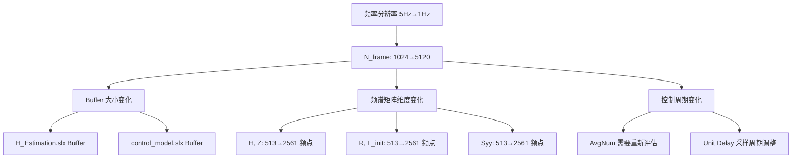

# MIMO 随机振动控制系统频率分辨率修改方案
## 从 5Hz 修改为 1Hz

---

## 1. 修改概述

### 1.1 核心参数变化

| 参数 | 修改前 | 修改后 | 计算公式 |
|------|--------|--------|----------|
| **Fs** (采样频率) | 5120 Hz | 5120 Hz | 不变 |
| **df** (频率分辨率) | 5 Hz | **1 Hz** | 目标 |
| **N_frame** (帧长/FFT点数) | 1024 | **5120** | N = Fs / df |
| **N_half** (单边谱点数) | 513 | **2561** | N/2 + 1 |
| **Overlap** (重叠点数) | 512 | **2560** | N/2 (50%) |
| **每帧时长** | 0.2s | **1.0s** | N / Fs |
| **控制周期** | ~6s (60帧×0.1s) | ~60s 或调整 | AvgNum × 帧间隔 |

### 1.2 影响分析



> [!WARNING]
> **之前发散的可能原因**：
> 1. Buffer 重叠设置与帧长不匹配
> 2. AvgNum 平均次数不足导致谱估计方差过大
> 3. Unit Delay 采样周期与谱平均周期不同步
> 4. Signal_Generator 中 Overlap-Add 参数未同步修改

---

## 2. M 文件修改清单

### 2.1 `prepare_control_model.m` (主要修改)

```diff
%% 1. 核心仿真参数
 Fs = 5120;                  % 采样频率 (Hz)
-N_frame = 1024;             % 帧长 (Buffer Size)
+N_frame = 5120;             % 帧长 (Buffer Size) - 对应 1Hz 分辨率
-AvgNum = 60;                % 谱估计平均次数
+AvgNum = 30;                % 谱估计平均次数 (调整：帧长变大，需要平衡控制周期)
-epsilon = 0.5;              % 矩阵幂次收敛因子
+epsilon = 0.5;              % 矩阵幂次收敛因子 (统一参数)
-T_sim = 200;                % 仿真时间 (s)
+T_sim = 300;                % 仿真时间 (s) - 延长以适应更长的收敛周期
 df = Fs / N_frame;          % 频率分辨率 (1 Hz)
 f = (0 : N_frame/2)' * df;  % 频率向量 [2561 x 1]
 n_freq = length(f);
```

**完整修改列表**：
| 行号 | 原值 | 新值 | 原因 |
|------|------|------|------|
| ~9 | `N_frame = 1024` | `N_frame = 5120` | 1Hz 分辨率需要 |
| ~10 | `AvgNum = 60` | `AvgNum = 30` | 控制周期平衡 |
| ~12 | `T_sim = 200` | `T_sim = 300` | 收敛时间增加 |

---

### 2.2 `prepare_control_model_2.m` (同步修改)

与 `prepare_control_model.m` 相同的参数修改。

---

### 2.3 `system_model.m` (无需修改)

该文件从仿真输出的 Timeseries 中读取数据，维度自动适配。

---

### 2.4 `H1_plot.m` (无需修改)

从 `system_model.mat` 加载数据，自动适配新维度。

---

### 2.5 `verify_control_results.m` / `evaluate_control_error.m` (无需修改)

从工作区变量读取，自动适配。

---

## 3. Simulink 模型修改清单

### 3.1 `H_Estimation.slx` 修改

#### 3.1.1 Buffer 模块 (2处)

| 模块名 | 参数 | 原值 | 新值 |
|--------|------|------|------|
| Buffer | N (Buffer size) | 1024 | **5120** |
| Buffer | V (Overlap) | 512 | **2560** |
| Buffer1 | N (Buffer size) | 1024 | **5120** |
| Buffer1 | V (Overlap) | 512 | **2560** |

**操作步骤**：
1. 双击 Buffer 模块
2. 修改 **Buffer size** 为 `5120`
3. 修改 **Overlap** 为 `2560`
4. 对 Buffer1 执行相同操作

#### 3.1.2 SpectralEstimation (MATLAB Function)

打开 MATLAB Function 模块，修改以下参数：

```matlab
% 修改前
Fs = 5120;          % 采样频率 (Hz)
N = 1024;           % FFT点数
N_half = N/2 + 1;   % 513

% 修改后
Fs = 5120;          % 采样频率 (Hz)
N = 5120;           % FFT点数 (对应1Hz分辨率)
N_half = N/2 + 1;   % 2561
```

---

### 3.2 `control_model.slx` 修改 (⚠️ 关键)

#### 3.2.1 Buffer 模块

| 参数 | 原值 | 新值 |
|------|------|------|
| Buffer size (N) | 1024 | **5120** |
| Overlap (V) | 512 | **2560** |

#### 3.2.2 Unit Delay 模块

> [!IMPORTANT]
> **这是之前发散的关键点！**

Unit Delay 的采样周期必须与一个完整的**控制修正周期**同步。

- **原设置**：`SampleTime = 0.1` (对应约 512 采样点，一帧的输出间隔)
- **新设置**：需要与 `AvgNum × 帧间隔` 匹配

计算新的控制周期：
- 帧间隔 = Overlap / Fs = 2560 / 5120 = **0.5s**
- 控制周期 = AvgNum × 帧间隔 = 30 × 0.5 = **15s**

**但 Unit Delay 不应设为 15s！** 它的作用是在连续采样中保持上一次的 L 值。

正确理解：
- Unit Delay 采样周期 = **帧间隔** = 0.5s

| 参数 | 原值 | 新值 |
|------|------|------|
| SampleTime | 0.1 | **0.5** |
| InitialCondition | L_init | L_init (不变) |

#### 3.2.3 Rate Transition 模块

| 参数 | 原值 | 新值 |
|------|------|------|
| OutPortSampleTime | 1/5120 | 1/5120 (不变) |
| InitialCondition | L_init | L_init (不变) |

#### 3.2.4 Signal_Generator (MATLAB Function) - ⚠️ 关键

```matlab
% 修改参数
N = 5120;               % FFT 点数 (原 1024)
Overlap = 2560;         % 重叠点数 (原 512)
Fs = 5120;              % 采样率 (不变)
N_half = N/2 + 1;       % 2561 (原 513)
```

**完整修改**：

```diff
function u = Signal_Generator(L_old, Z)
     % %% 1. 参数定义
-    N = 1024;               % FFT 点数
-    Overlap = 512;          % 重叠点数 (50%)
+    N = 5120;               % FFT 点数 (对应 1Hz 分辨率)
+    Overlap = 2560;         % 重叠点数 (50%)
     Fs = 5120;              % 采样率
     df = Fs / N;            % 频率分辨率
-    N_half = N/2 + 1;       % 513
+    N_half = N/2 + 1;       % 2561
```

#### 3.2.5 Response_spectrum_calculation (MATLAB Function) - ⚠️ 关键

```diff
function [Syy, isPeriod] = Response_spectrum_calculation(y)
     % %% 1. 参数定义
-    N = 1024;           % FFT 点数
+    N = 5120;           % FFT 点数 (对应 1Hz 分辨率)
     Fs = 5120;          % 采样率
-    AvgNum = 60;        % 平均帧数
+    AvgNum = 30;        % 平均帧数 (调整)
-    N_half = N/2 + 1;   % 513
+    N_half = N/2 + 1;   % 2561
```

#### 3.2.6 Controller (MATLAB Function) - 稳定性增强

```diff
function L_new = Controller(L_old, Syy, R, isPeriod)
     % %% 1. 参数设置
-    epsilon = 0.7; 
+    epsilon = 0.5;  % 【统一】与 prepare_control_model.m 一致
     
     reg_val = 1e-12; 
+    
+    % 【新增】收敛监控变量
+    persistent iteration_count convergence_history
+    if isempty(iteration_count)
+        iteration_count = 0;
+        convergence_history = [];
+    end
     
     % %% 2. 逻辑判断
     if isPeriod
+        iteration_count = iteration_count + 1;
         
         % ... 现有的 Syy 有效性检查 ...
         
         L_new = complex(zeros(size(L_old)));
         N_half = size(L_old, 1);
+        
+        % 【新增】收敛误差计算
+        total_error = 0;
         
         for k = 1:N_half
             % ... 现有的 Cholesky 分解代码 ...
             
             % --- 步骤 C: 计算误差矩阵 Delta ---
             Delta = Lr / Ls;
             
+            % 【新增】Delta 条件数检查
+            if rcond(Delta) < 1e-10
+                % Delta 接近奇异，跳过本频点修正
+                L_new(k, :, :) = L_old_k;
+                continue;
+            end
             
             % --- 步骤 D: 矩阵幂次修正 ---
             Correction = Delta ^ epsilon;
             
             % --- 步骤 E: 更新控制变量 ---
             L_new(k, :, :) = Correction * L_old_k;
+            
+            % 【新增】累加误差
+            total_error = total_error + norm(Syy_k - R_k, 'fro');
         end
+        
+        % 【新增】记录收敛历史（可选：通过输出端口导出）
+        avg_error = total_error / N_half;
+        fprintf('Iteration %d: Avg Error = %.6e\n', iteration_count, avg_error);
         
     else
         L_new = L_old;
     end
 end
```

---

## 4. 防止发散的关键检查清单

> [!CAUTION]
> **修改后必须逐项验证以下内容！**

### 4.1 维度一致性检查

| 变量 | 预期维度 | 检查命令 |
|------|----------|----------|
| `f` | [2561 × 1] | `size(f)` |
| `R` | [2561 × 2 × 2] | `size(R)` |
| `Z` | [2561 × 2 × 2] | `size(Z)` |
| `L_init` | [2561 × 2 × 2] | `size(L_init)` |

### 4.2 参数一致性检查

| 参数 | prepare_control_model.m | Signal_Generator | Response_spectrum | Controller |
|------|-------------------------|------------------|-------------------|------------|
| N_frame / N | 5120 | 5120 | 5120 | - |
| N_half | 2561 | 2561 | 2561 | 自动 |
| AvgNum | 30 | - | 30 | - |
| epsilon | 0.5 | - | - | 0.5 |
| Overlap | - | 2560 | - | - |

### 4.3 Buffer 与 MATLAB Function 同步检查

```
Buffer 输出维度 = [N_frame × 通道数] = [5120 × 2]
                    ↓
MATLAB Function 输入检查 = N × 2 (N 必须 = 5120)
```

### 4.4 信号流时序检查

```
帧间隔 = Overlap / Fs = 2560 / 5120 = 0.5s
控制周期 = AvgNum × 帧间隔 = 30 × 0.5s = 15s
Unit Delay 采样周期 = 0.5s ✓
```

---

## 5. 验证计划

### 5.1 第一阶段：系统辨识验证

1. 运行 `spaceABCD.m` 生成状态空间矩阵
2. 修改 `H_Estimation.slx` 的 Buffer 和 MATLAB Function
3. 运行 `H_Estimation.slx` (仿真时间 ≥ 60s)
4. 运行 `system_model.m` 处理数据
5. **验证**：`size(H)` 应为 `[2561, 2, 2]`
6. 运行 `H1_plot.m` 检查频响曲线

### 5.2 第二阶段：闭环控制验证

1. 修改 `prepare_control_model.m` 并运行
2. **验证**：
   - `size(R)` = `[2561, 2, 2]`
   - `size(L_init)` = `[2561, 2, 2]`
3. 修改 `control_model.slx` 所有参数
4. 运行 `control_model.slx` (仿真时间 300s)
5. 观察命令窗口的收敛监控输出
6. 运行 `verify_control_results.m` 检查控制效果

### 5.3 发散诊断

如果仍然发散，检查以下指标：
- Controller 输出的 `Avg Error` 是否持续增大
- `L_new` 中是否有 NaN 或 Inf
- `Syy` 在低频段是否接近零

---

## 6. 修改顺序建议

> [!TIP]
> **强烈建议按照以下顺序执行修改**

```
1. 备份当前所有文件
      ↓
2. 修改 M 文件 (Agent 执行)
   - prepare_control_model.m
   - prepare_control_model_2.m
      ↓
3. 运行 spaceABCD.m (如果尚未运行)
      ↓
4. 修改 H_Estimation.slx (用户操作)
   - Buffer × 2
   - SpectralEstimation
      ↓
5. 运行 H_Estimation + system_model.m
      ↓
6. 验证 system_model.mat 中的维度
      ↓
7. 修改 control_model.slx (用户操作)
   - Buffer
   - Unit Delay
   - Signal_Generator
   - Response_spectrum_calculation
   - Controller
      ↓
8. 运行 prepare_control_model.m
      ↓
9. 运行 control_model.slx
      ↓
10. 验证收敛性
```

---

## 7. 回退方案

如果修改后系统仍然发散，可以考虑以下调整：

1. **减小 epsilon**：从 0.5 降到 0.3，牺牲收敛速度换取稳定性
2. **增加 AvgNum**：从 30 增加到 60，提高谱估计精度
3. **增加正则化**：`reg_val` 从 1e-12 增加到 1e-10
4. **限制频段**：只对 10-2000Hz 进行修正，低于 10Hz 保持原值
