# 摘要

振动环境虚拟试验研究对提高产品研发效率、降低成本、优化产品设计等具有重要的实际工程应用意义。但国内外虚拟振动环境试验的研究主要集中在有限元分析方法和单电动振动台虚拟试验，至今没有对单轴多振动台和多轴多振动台进行虚拟振动环境试验的研究成果，并且大多虚拟试验都是采用正弦激励振动试验，采用高斯随机激励的虚拟振动试验的研究工作较少。因此，本文在研究电动振动台机械结构、电磁特性的基础上，基于多种软件设计了一套多输入多输出虚拟振动环境试验的构建方案。主要研究工作包括：

通过试验测试得到的电动振动台定压和定流加速度频响特性曲线对电动振动台集中参数和电参数进行识别，并根据这些参数采用Vitrual.lab和Matlab/Simulink软件平台建立了电动振动台机械电磁系统仿真模型。

分析并采用时域随机化随机输入信号生成方法和矩阵幂次修正算法建立了MIMO随机振动控制系统，并通过梁有限元模型MIMO随机振动控制仿真试验对该控制系统的有效性进行了验证。

通过导弹试验件模态试验对导弹有限元模型进行了修正，并采用修正后的导弹有限元模型实现了与双电动振动台机械模型的刚柔耦合建模。

联合建立的双电动振动台机电系统、导弹与振动台刚柔耦合模型和闭环振动控制系统进行了多输入多输出虚拟随机振动控制试验，仿真试验结果表明该振动控制仿真系统具有良好的随机振动控制效果，并且能观察导弹模型上各个监测点在试验过程中的加速度响应情况。

最后在两个型号为ES-80LS3-445电动振动台上进行了导弹模型多输入多输出随机振动控制试验，并将控制结果和监测点加速度响应结果与联合仿真试验结果进行了对比，对比结果表明该联合仿真试验具有一定反映导弹模型真实响应特性的能力。

关键词：振动环境试验，多输入多输出，虚拟试验，振动控制，电动振动台

# Abstract

Virtual vibration experiment aiming at improving the efficiency of product development, reducing costs, optimizing the product design is of important significance in engineering practice. The research on virtual vibration experiment mainly concentrated in the finite element method and the single electric shaking table vibration testing simulation. There is no research result on virtual vibration experiment about single shaft vibration table and multi-axis vibration table. And most of the virtual test is the sine excitation vibration test. Therefore, based on the study of the mechanical structure and electromagnetic properties of the electric shaking table, the construction scheme of multi input multi output virtual vibration environment test is designed in this paper.

Major research works in this paper are shown as following.

Parameters of electric shaking table are obtained by testing the acceleration frequency response curve. Then according to these parameters Matlab/Simulink and Vitrual.lab software platform are used to build the electric shaking table simulation model.

The random input signal generation method and the matrix power algorithm are used to establish the MIMO random vibration control system. The validity of the control system is verified by carrying out the MIMO random vibration control simulation test with beam model.

The missile modal test is carried out to amend the finite element model. Then the rigid flexible coupling modeling of double electromagnetic shaking model and the finite element model is built.

A co-simulation of double electromagnetic shaking model, the rigid flexible coupling model and the MIMO random vibration control system is carried out. The simulation results show that the vibration control simulation system has satisfactory vibration control effect, and the acceleration response of each monitoring point is observed.

The multi input and multi output random vibration control test of the missile model is carried out on the two shaking table. The comparison results show that the co-simulation test has the ability to reflect the true response of the missile model.

Keywords: vibration environment test, multi-input-multi-output (MIMO), vibration control, virtual test, electrodynamic shaker

# 目录

# 第一章 绪论

1.1 研究背景与意义  
1.2 国内外研究现状 2

1.2.1 国内外虚拟仿真试验研究状况 ..... 2  
1.2.2 国内外多振动台随机振动控制算法研究状况 ..... 5

1.3本文的主要研究工作 6

# 第二章 电动振动台系统分析 ..... 8

2.1 电动振动台系统组成与机械构造 ..... 8

2.1.1 电动振动台运动部件 ..... 9  
2.1.2 悬挂与导向装置 11  
2.1.3 振动台台体隔振方式 ..... 12

2.2 电动振动台工作频率特性 ..... 12

2.2.1 定驱动电压下的加速度频率特性 ..... 13  
2.2.2 定驱动电流下的加速度频率特性 ..... 15

2.3 电动振动台主要性能参数 ..... 16

2.3.1 工作频带和额定推力 16  
2.3.2加速度幅值均匀度和波形失真度 16  
2.3.3 横向振动比 ..... 17

2.4 本章小结 ..... 17

# 第三章 虚拟振动环境试验构建方法 18

3.1 虚拟振动环境试验建立主要流程 ..... 18  
3.2 构建虚拟环境试验系统的软件功能介绍 ..... 19

3.2.1 LMS Virtual.Lab 软件功能介绍 ..... 19  
3.2.2 Matlab/Simulink 软件功能介绍 ..... 21  
3.2.3 LMS Virtual.Lab 与 Matlab/Simulink 联合仿真 ..... 23

3.3 构建虚拟振动环境系统的线性有限元法 ..... 24  
3.4 本章小结 ..... 25

# 第四章 基于MATLAB/SIMULINK的MIMO随机振动控制 26

4.1 频响函数估计方法 ..... 27  
4.2随机输入信号的生成 28  
4.3 矩阵幂次控制算法 30  
4.4 MIMO随机振动控制系统仿真验证 31

4.4.1 频响函数估计 31  
4.4.2 MIMO控制系统仿真验证 32

4.5 本章小结 33

第五章 虚拟MIMO随机振动试验及验证 35

5.1 电动振动台机械电磁系统的建立 35  
5.2虚拟振动环境试验系统建立 38

5.2.1 试验件有限元模型建立与修正 ..... 38  
5.2.2 双电动振动台导弹刚柔耦合模型 ..... 43  
5.2.3 双电动振动台导弹模型 Simulink 仿真系统建立 ..... 46

5.3联合仿真与试验验证 48

5.3.1 虚拟随机振动控制试验 ..... 48  
5.3.2 试验验证 ..... 50

5.4 本章小结 ..... 51

第六章 总结与展望 52

6.1 本文主要工作和贡献 ..... 52  
6.2 后续研究与展望 ..... 52

参考文献. 54

致谢 57

在学期间的研究成果及发表的学术论文 58

# 图表清单

图1.1单轴直线式电动振动台及系统实景图 2  
图2.1电振动台振动试验系统 8  
图2.2电动振动台结果原理简图 9  
图2.3动圈组合体实体图与二自由度等效力学模型 10  
图2.4电动振动台运动力学模型 12  
图2.5运动模型等效电路图 13  
图2.6典型恒定驱动电压下加速度幅频特性 14  
图2.7典型恒定驱动电流下加速度幅频特性 16  
图3.1 STATEFLOW仿真原理示意图 22  
图3.2VL与SIMULINK联合仿真机械动力系统模块 23  
图3.3有限元法系统流程框图 24  
图4.1MIMO随机振动控制系统流程框图 27  
图4.2时域随机化过程框图 28  
图4.3 新一帧伪随机信号随机抽取过程示意图 29  
图4.4真随机输入信号加窗叠加生成过程示意图 29  
图4.5矩阵幂次算法控制流程框图 31  
图4.6悬臂梁节点划分有限元模型 31  
图4.7悬臂梁频响函数估计SIMULINK模型图 31  
图4.8悬臂梁模型频响函数幅频图 32  
图4.9多输入多输出梁模型振动控制系统模型图 32  
图4.10多输入多输出振动控制修正前结果 33  
图4.11多输入多输出振动控制修正结果 33  
图5.1电动振动台机械结构集中质量模型 36  
图5.2单电动振动台机电系统SIMULINK模型 37

图5.3定电压下电动振动台试验频响与仿真频响对比图 38  
图5.4定电流下电动振动台试验频响与仿真频响对比图 38  
图5.5导弹模型模态分析试验现场 39  
图5.6导弹模型前五阶模态 41  
图5.7导弹有限元模型模态振型 43  
图5.8双电动振动台导弹模型图 43  
图5.9导弹柔性体刚柔耦合模态振型 46  
图5.10导弹有限元模型输出点位置 46  
图5.11双电动振动台导弹模型SIMULINK频响测试系统图 47  
图5.12双电动振动台导弹模型随机振动控制SIMULINK仿真系统图 47  
图5.13导弹模型控制点和监测点位置 48  
图5.14双电动振动台导弹模型的频响函数曲线图 48  
图5.15双电动振动台导弹模型仿真试验控制点控制结果 49  
图5.16仿真试验监测点加速度功率谱密度以及均方根值 49  
图5.17 双电动振动台导弹模型振动控制试验现场 ..... 50  
图5.18双电动振动台导弹模型控制试验控制点2和8自谱控制结果 50  
图5.19控制试验监测点加速度功率谱密度以及均方根值 51  
表 2.1 常用动圈骨架材料及其性能 ..... 11  
表 5.1 型号 ES-80LS3-445 电动振动试验系统工作性能 ..... 35  
表 5.2 电动振动台机电模型各参数具体值 ..... 37  
表 5.3 导弹有限元模型前五阶固有频率 ..... 41  
表 5.4 电动振动台导弹模型刚柔耦合模态前 20 阶固有频率

注释表  

<table><tr><td>Ks</td><td>悬挂弹簧刚度</td><td>Ka</td><td>动圈骨架粘合刚度</td></tr><tr><td>Ke</td><td>试验件与台面连接刚度</td><td>Me</td><td>试验件的质量</td></tr><tr><td>MT</td><td>台体台面质量</td><td>MC</td><td>驱动线圈质量</td></tr><tr><td>TSR</td><td>横向振动比</td><td>X</td><td>输入信号矩阵</td></tr><tr><td>Y</td><td>输出信号矩阵</td><td>Syx</td><td>互功率谱密度矩阵</td></tr><tr><td>Sxx</td><td>自功率谱密度矩阵</td><td>P</td><td>相位信息矩阵</td></tr><tr><td>D</td><td>驱动频谱矩阵</td><td>A</td><td>补偿矩阵</td></tr><tr><td>G</td><td>系统频响函数矩阵</td><td>Sdd</td><td>输入信号功率谱矩阵</td></tr><tr><td>R</td><td>参考谱矩阵</td><td>Syy</td><td>响应谱矩阵</td></tr><tr><td>E</td><td>误差修正矩阵</td><td>Δ</td><td>修正矩阵</td></tr><tr><td>ε</td><td>收敛幂指数</td><td>B</td><td>磁场强度</td></tr><tr><td>l</td><td>单匝线圈长度</td><td>n</td><td>线圈总匝数</td></tr><tr><td>i</td><td>线圈内的电流</td><td>Kf</td><td>力常数</td></tr><tr><td>x̂</td><td>线圈相对磁场的速度</td><td>L</td><td>驱动线圈自感系数</td></tr><tr><td>e</td><td>线圈两端的电压</td><td>mc</td><td>驱动线圈质量</td></tr><tr><td>mt</td><td>台面质量</td><td>mb</td><td>悬挂装置质量</td></tr><tr><td>xc</td><td>驱动线圈位移</td><td>xt</td><td>台面位移</td></tr><tr><td>xb</td><td>悬挂装置位移</td><td>kc</td><td>台面与驱动线圈间刚度</td></tr><tr><td>ka</td><td>动圈与悬挂装置间刚度</td><td>kb</td><td>空气气垫的刚度</td></tr><tr><td>cc</td><td>台面与驱动线圈间阻尼</td><td>ca</td><td>动圈与悬挂装置间阻尼</td></tr><tr><td>cb</td><td>空气气垫的阻尼</td><td></td><td></td></tr></table>

# 缩略词

缩略词

英文全称

KBT

Knowledge Based Testing

VETO

Virtual Environment for Test Optimization

MIMO

Multi-input and Multi-output

# 第一章 绪论

# 1.1 研究背景与意义

随着航空、航天以及机械电子制造业的发展，人们对产品、部件在各种复杂环境下工作的可靠性、寿命、安全性的要求越来越严格。因此，在研发产品的过程中，投入到模拟各种复杂环境以检验产品质量、性能的试验比重越来越大。例如在航天器的研制过程中，因其在发射、外太空飞行中会经受到振动冲击、温度变化、辐射等复杂元素的影响，便需要在产品投入使用前进行环境试验，以验证产品的可靠性及安全性。因振动冲击对产品的结构强度、使用寿命影响较大，在环境试验中振动环境试验有着至为重要的地位。

振动环境试验按激励可分为以下几种：正弦振动试验、冲击振动试验、随机振动试验、正弦加随机振动试验、随机加随机振动试验[1]。而工程中振动问题大多是随机振动问题，例如高速飞行的飞行器产生的振动，汽车、飞机等发动机引起的振动，或者高速行驶的火车受到铁轨的振动等等。测试产品在随机激励下的各项性能就需要采用随机振动试验[1]。

目前，随机振动环境试验一般是通过靠振动台提供激励来完成的，用于振动试验的振动台主要是机械振动台、电液振动台和电动振动台，其中电动振动台运用最为广泛，其具有频带范围宽、波形完整、较好控制等优点。电动振动台按其结构形式可分为以下几种：按动圈与功放的耦合方式可分直接驱动式和感应式；按磁路形式可分为单磁路式和双磁路式；按形成磁场的方法可分为永磁式和励磁式；按冷却方式可分为自然冷却、风冷和液体令却等类型；按产生振动的自由度数可分为单自由度式、双自由度式和三自由度式（包括直线、扭转和弯曲振动等）。早期的振动台一般是以单自由度为主，但由于产品工作环境的复杂性，单轴激励进行的随机振动环境试验已不能满足工业发展的需要，多轴振动台随机振动试验的研究已成为大势所趋。与单轴振动台相比，多轴振动台随机振动试验有着如下几个优点：可以提供足够大的推力，满足大实验量级级、大结构的试验需求；可以提供多轴向的振动，更准确的模拟实际振动环境；对细长的结构进行激振时，单振动台激励会在结构安装连接处产生集中应力，不符合实际受力情况且会对结构产生极大损伤；同时多轴振动台试验可以进行多个抽向试验，减少试验时间，避免重复工作等等。

通过实际试验件振动环境试验可以直观的检测到试验件在各个量级振动下的应力应变情况，得到的测试数据正确可靠，然后通过试验结果能够实现对试验件结构材料的优化设计，但不可避免的存在一些缺陷。例如试验准备周期较长，耗资巨大；在试验台也难以实现实际工程中的振动情况；对一些结构复杂的产品，局部的应力应变数据难以采集；对于尺寸巨大的产品如大

型飞机，难以在振动台上实现全尺寸振动试验。因此，针对以上的几个问题，采用新的技术手段，加快试验效率并保证一定的正确性，成为了现如今主流的研究方向。虚拟振动环境试验分析便能较好的解决以上问题，能够在实际具体试验之前尽可能得到试验件在该振动环境下的响应信息及各点的应力应变情况，能够及时发现并解决试验中容易出现的问题，避免重复的工作量，同时降低了试验成本，例如针对大型试验件的环境试验等。

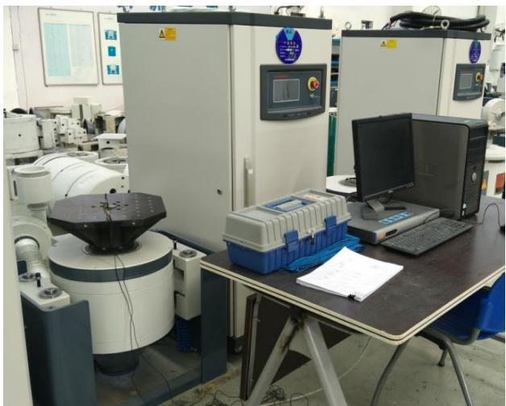  
图1.1单轴直线式电动振动台及系统实景图

振动试验仿真技术已在不断的发展进步，传统的振动试验仿真方法是采用有限元软件搭建振动台以及简化振动台模型，但传统方法没有创建完善的虚拟振动环境试验仿真系统[2-4]。

# 1.2 国内外研究现状

# 1.2.1 国内外虚拟仿真试验研究状况

目前国外在航空航天领域中对模拟振动环境试验仿真研究较为突出的代表性企业有NASA、Airbus、ESA[5]及  $\mathrm{ESTC}^{[6-9]}$  等等。上世纪九十年代中期，美国国家航空航天局实验室就提出了一种名为“KBT(Knowledge Based Testing)”的方法，其目的就是为了提高产品的结构性能可靠性、优化产品的测试方案设计。基于这个概念，其研究人员主要对以下三个方面进行了研究：第一个是开发利用“VETO(Virtual Environment for Test Optimization)”软件，使用“VETO”软件工具，分析测试研究人员便可在产品设计开始阶段，对整套试验流程进行数字仿真，可以进行试验件的模态计算、试前分析、振动模拟等；第二个是使用“stereo lithography”技术对试验件进行快速、低成本、高精确的制造，其制造出来的塑料模型能够校精确的体现产品结构特性，与有限元建模的模型相比，其更能体现实际产品的细节信息如倒角、螺孔等；第三个是数字模型仿真精度的优化，提高数字仿真的可靠性和可信度。通过“VETO”软件工具，将测试方案设计与快速生产的产品的测试试验结果相结合，对产品数字模型的修正方案进行较有效的优化设计。

2007年，ESA与AOES[10]公司合作建立了一套虚拟振动试验系统，该系统能够在对产品进行振动测试实验之前，对产品结构模态等特性做初步了解，为振动试验做好数据准备，提前预示产品试验风险，并且能取代部分测试试验。通过该模拟试验系统，该两家研究人员总结了电动振动台动圈、线圈、阻抗、电感系数等参数对振动测试试验的影响，确定了一下结论：利用模拟振动试验系统，振动测试分析工程师能够采集到产品在振动环境下的具体表现，其相应的结果与实际试验的表现可以吻合，具有一定的仿真准确性；利用该模拟振动试验系统可以一定程度的避免振动环境试验中的过试验、欠试验等情况；同时，大幅缩减了实际试验的测试周期，减少了大量成本投入。

基于KBT理念，在1996年，Klenke等人[11]就提出了一种优化虚拟振动环境试验的方法，即通过VETO软件环境能够使放置振动控制器和响应传感器的位置为最佳，并且对振动试验设计所需的测试参数进行优化选择，表明通过使用硬件在环仿真技术能够使振动试验更为有效简便。1997年，Lang.GF[12]对电动振动台进行了研究，提出了其运行的几个运动机制。在2008年，Ricci等人[6]提出了一种虚拟振动测试方法，其意义在于将所有可能影响到结构动态特性的参数加以分析，形成一套对具体实验设备的仿真模拟实验系统。首先建立机电耦合参数振动模型，模型参数通过特定实验获得，然后基于控制算法并通过硬件在环HIL仿真形成振动控制器，在此基础上通过耦合振动与闭环控制方法进行虚拟振动试验。

此外，在虚拟试验方面，2000年，Conte和Trombetti[13]建立了一个单轴单自由度的伺服液压振动台的仿真模型，将其应用到对振动台调试的辅助并进行振动仿真试验，指明了其对真实试验具有指导作用。2004年，Bradford和Patrick基于simulink对振动台仿真模型进行深入研究，解决了振动台与试验件、夹具之间的调试问题。2011年，Shawn等人[14]总结了采用多体动力学分析软件的虚拟试验的优缺点，提出混合仿真能够弥补由于建模不准确带来的仿真与试验结果相差较大的缺点，并且对硬件在环的混合仿真方法提出了几种改进意见。2013年，Daborn[15]等人研究了传统模拟实验在气动随机激励研究领域中的不足，提出了一种替代刚体振动台的新的模拟方法，可以从多个位置激励且不对结构提供主要支撑，同时采用了多输入多输出的振动控制方法。同年，Souza等人[16]研究了用有限元建模来测试汽车零部件固有频率的局限性。2014年，Kumar等人[17]通过ANSYS有限元模拟研究了汽车传输壳体的固有振动分析试验。

国内对建立虚拟振动环境试验的仿真技术研究起步较晚，从2000年开始才有一些研究成果，且大部分仿真技术的研究主要是针对电动振动台。

目前，大部分电动振动台的仿真试验都是通过有限元进行建模，通过频响分析等确定振动台的动力性能，然后与实际振动台进行对比并加以改正，最后建立出可用于虚拟试验的振动台模型。2001年，邱吉宝、胡绍全[18]等人首先展开了针对电动振动台虚拟仿真技术的研究课题，并展示了一些成果。2003年，朱元夫[19]分别建立了振动台机械结构、夹具、及试验件的有限元

模型，通过分析试验产品的模态测量试验及振动试验结果对产品有限元模型及振动台仿真模型进行修正，并用实际试验结果对仿真结果进行验证，表明了该仿真方法具有一定的可行性。2004年，向树红等[20]侧重介绍了有限元数字模型修正技术及建模方法，建立了40吨振动台的有限元模型，分析了振动台各部件的物理特性，并对其进行空台振动试验的计算机虚拟仿真。2005年，范宣华[21]分别对振动台动圈、线圈进行有限元建模并通过模态分析和模态实验进行了优化修正，通过正弦扫描虚拟实验验证其建模方法的真实性，体现了电振动台的真实动态特性。到2008年，国内对虚拟振动环境试验的研究才真正起步，北京511所[22]设计了一套建立虚拟振动试验系统的流程方案，并应用到实际研发项目中。2009年，张逸波、齐晓军、张丽新等[23]研究了某一型号的电动振动台，并建立其动圈的有限元模型，通过实际模态试验对动圈模型进行了修正，以修正后的模型为基础模拟了正弦扫频试验，验证了该模型能够体现实际振动台动圈的响应情况。2010年，谭永华、蔡国飙[24]建立了单振动台刚体模型和数学模型并对夹具柔性化，通过Virtual.Lab Motion与Matlab/Simulink的进行了联合仿真，最后实现了虚拟正弦扫描试验的过程可视化。2011年，张琳、邓长华等[25]在对电动振动台进行机电耦合建模的基础上，结合试验件的有限元模型进行了虚拟随机振动试验，其建立的仿真模型和方案能较好地实现随机振动试验的仿真。2011年齐晓军、张逸波[26]等人对电动振动台的不同部分分别进行模拟，对材质尺寸细化处理，然后将各部分拼接起来，从而提高仿真精度。2012年，李霖圣[27]研究了采用多种系统仿真软件对带试验件的电动振动台机电模型进行联合仿真的技术，并进行了试验件的虚拟正弦振动试验。

从近十年来的参考文献中可以总结出如今较为成熟的虚拟振动试验系统设计方案：振动台机械系统模型通过Patran建立，然后将模型导入Virtual.lab进行模态分析，振动试验系统中数字信号处理系统通过Matlab软件进行仿真，最后建立Virtual.labMotion与Matlab/Simulink的联合仿真实现整个虚拟振动试验系统。具体的仿真系统建模过程如下：1）通过建模软件对振动台各子结构包括动圈、静圈夹具等进行结构的有限元建模，并通过模态分析对各子结构进行有限元修正；2）在Virtual.lab软件中建立振动台的多体动力学模型，对需要进行有限元分析的子结构进行柔性化，即用建立好的有限元模型进行替换，并确定各个结构直接的装配关系；3)在AMESim中建立与Virtual.lab相联系的电磁作动系统，加入机电耦合模型能够体现电振动台在频域上的机械特性和电气特性；4)在Matlab/Simulink中建立振动控制系统模型，利用Matlab高效的数据信号处理能力，对振动试验系统的输入输出进行闭环仿真控制，根据用户需要进行正弦扫频或随机振动控制；5）在Vitrual.lab中设定与Matlab进行联合仿真，将建立的振动台多体动力学模型输出为一个m文件，并在Matlab/Simulink中与振动控制系统相结合，完成整套虚拟振动环境试验系统的建立。

以上文献中的振动台虚拟振动试验都是对单轴单振动台的研究，至今没有对单轴多振动台

和多轴振动台进行振动仿真建模的文献，并且大多虚拟试验都是采用正弦扫频试验，采用高斯随机激励的振动虚拟试验的文献较少。实现振动台多体动力模型系统、电磁作动系统、振动控制系统所需要的运行软件较多，采用更高效的联合仿真办法仍需进一步研究。

# 1.2.2 国内外多振动台随机振动控制算法研究状况

在多输入多输出振动系统中，由于振动台之间耦合作用问题的存在，解耦问题成为多振动台振动测试系统的急需解决的重要问题。自1970年以来，Smallwood等人在多输入多输出随机振动控制领域中建立了数字式振动控制理论基础和技术框架，其对多振动台随机振动控制的众多研究文献为后人在该领域的研究提供了理论依据，因而被称为多输入多输出随机振动控制领域的奠基人。1982年， $\mathrm{Smallwood}^{[28]}$ 在对单个试验件进行多振动台激励的基础上，解决了多激励耦合和多激励的时域随机化问题，并提出采用了差分控制算法，该算法也成为多家厂商对振动台进行振动控制的基础理论算法。1994年Underwood[29]设计了一个多振动台数字扫频跟踪滤波器并进行了多振动台扫频控制试验。而后Smallwood总结了多输入多输出振动台试验振动控制技术的研究成果，对差分控制算法进行了改进以解决振动控制中存在的问题。2004年，Underwood[30]研究了输入数与输出数不等的多振动台激励的情况下响应点的控制方法，并显示了良好的控制效果。2007年， $\mathrm{Smallwood}^{[31]}$ 研究了多振动台自谱控制下输入与输出的约束关系，对参考谱的设置进行了理论分析并提出了可行性的参考意见。2012年， $\mathrm{Smallwood}^{[32]}$ 研究分析了多轴振动台低频振动测试方法，在将试验件响应视为刚性体响应的假设下，提出了一种检验控制测量误差的手段。2013年， $\mathrm{Smallwood}^{[33]}$ 对多输入多输出振动试验的输出互谱的设置问题进行了深入研究，在确定输出点（控制点）自谱的条件下，通过推导输出点互谱来最大程度的减少输入信号（驱动信号）的自谱密度大小，并保证输入谱密度矩阵是正定的，提出了一种最少能量输入的优化方案。

如今随机振动控制试验主要是以控制输出点的加速度功率谱密度为主，频带范围一般在  $5 - 2000\mathrm{Hz}$  左右，控制算法的理论推导大都是以矩阵理论为基础，而后来因为现代控制理论的迅速崛起，研究人员便开始利用现代控制理论对振动台进行振动控制，但因为其对控制模型、系统的仿真精度要求高，高频段的控制往往难以实现，只能对低频段的振动试验进行振动控制。

国内在多振动台振动控制领域的研究从八十年代末才开始，为了响应国家大力发展国防事业的号召，国内以北京强度环境研究生和机电工程研究所为代表的多家研究院所和大学高校便展开了多振动台振动控制技术和相关算法理论的研究工作。吴家驹研究了多点激励互谱模拟技术和多维振动台环境试验方法。陈立伟、卫国[34]分析了多轴振动台随机激励下的试验条件设定办法。徐浩[35]、孙成宽[36]分别提出了多点冲击激励和多点混合激励下的振动响应控制算法。田玉虎[37]、游伟倩[38]研究了现代  $\mathbf{H}_{\infty}$  理论并对双振动台随机振动控制作了讨论和分析。贺旭东[39-40]

研究了随机驱动信号的产生办法并提出了一种新的FIR滤波器法，而后其又研究了随机振动控制的自谱收敛稳定问题提出了比例均方根控制算法。叶凌云[41]提出基于X滤波的自适应逆控制算法，该算法能够改善多轴向多激励随机振动的控制精度。崔旭利[42]提出了矩阵幂次控制算法，矩阵幂次控制算法不仅具有稳定收敛的自功率谱控制性能，还具有互功率谱的控制能力。陆勇星、郭家骅[43]研究了高阶累积量谱并将其应用到多点随机振动控制系统中，提出了通过双谱以生成时域随机驱动信号的办法，同时能改善高斯白噪声的影响。韩俊伟、张连朋[44]介绍了国内外多振动台的发展趋势，认为超大规模多振动台和多自由振动台已成为主要研究对象，并从动力学、自由度分解合成以及同步控制等方面对大规模多自由度振动台控制算法进行了分析。王海东[45]等人研究了多点激励功率谱再现振动控制算法，基于比例均方根算法，采用改进的功率谱均衡控制的方式，有效的避免了自谱控制中产生负值和零值问题，并具有有效的、精度高的控制效果。由于国内对多振动台或多自由度振动台振动试验系统的研究时间较短，相比于日本、美国、瑞士等国家在该领域的技术水平仍有很大进步空间，相关的理论和技术认知需要进一步的研究发展，这对打破国外技术封锁、发展国家国防工业具有重要意义。

# 1.3 本文的主要研究工作

从以上的文献论述可知，振动环境虚拟实验研究分析对提高产品研发效率、降低成本、全面了解产品特性等具有重要的实际工程应用意义。但国内外虚拟振动环境试验的研究主要集中在有限元分析方法和单电动振动台虚拟试验，至今没有对单轴多振动台和多轴振动台进行虚拟振动环境试验的研究成果，并且大多虚拟试验都是采用正弦激励振动试验，采用高斯随机激励的虚拟振动试验的研究工作较少。因此，本文在研究电动振动台机械结构、工作特性的基础上，采用多种软件联合建立双电动振动台导弹试验件机电耦合系统仿真模型，进行多输入多输出虚拟随机振动控制试验。

根据具体研究工作内容，本文各章的工作安排如下：

第一章：简单叙述虚拟振动环境试验和多输入多输出控制算法的发展历程和现如今的研究状况，提出研究多输入多输出虚拟振动环境试验的发展前景和研究意义，并根据国内外虚拟振动环境试验的研究欠缺，明确本文主要研究方向和工作。

第二章：重点研究电动振动台的系统组成及其各个结构、装置的主要功能用途，采用机电类比的方式详细分析电动振动台在恒定驱动电压和恒定驱动定流下的加速度工作频响特性。最后简单了解衡量电动振动台性能优劣的一些重要参数及其计算方式。

第三章：研究建立虚拟振动环境试验仿真系统的主要流程步骤，了解各种主要建模软件平台的功能和用途，设计联合各个软件进行虚拟振动环境试验创建的设计方案。

第四章：研究MIMO随机信号生成方式和矩阵幂次修正算法，设计MIMO随机振动控制系统的闭环控制方案，基于此方案建立MIMO随机振动控制系统并采用状态空间法进行梁有限

元模型MIMO振动控制仿真试验，以验证建立的振动控制系统的有效性和可靠性。

第五章：首先通过频响测试试验结果进行电动振动台集中参数、电参数的确定，建立电动振动台机电模型系统；然后设计导弹试验件模态试验对导弹试验件有限元模型进行修正，并对双电动振动台和导弹柔性体模型进行刚柔耦合模态分析；接着研究建立双电动振动台导弹模型振动控制仿真系统并进行闭环随机振动控制联合仿真试验；最后设计实际导弹试验件随机振动控制试验，与仿真控制结果进行验证对比。

第六章：进行本文的主要研究工作总结，分析研究工作中的不足并提出对未来研究内容的展望。

# 第二章 电动振动台系统分析

在航空航天振动环境试验领域中，电动振动台由于其具有较广的激励频带范围和控制的易用性，引起了广泛的重视和应用。电动振动台的结构种类繁多，按驱动线圈与功率放大器的耦合方式分为直接驱动和感应驱动；按磁路数目分为单磁路和双磁路式；按形成磁场方式分为永磁和励磁式；按产生激励的自由度数分为单轴式、双轴式和三轴式振动台。本章主要挑选单自由度直接驱动式的电动振动台进行讨论分析，大多数振动环境试验均是在此类电动振动台上进行。

# 2.1 电动振动台系统组成与机械构造

电动振动台的系统组成主要包括振动台、功率放大器、水平滑台、冷却装置、控制系统、加速度传感器等，振动试验系统框图如图2.1所示。

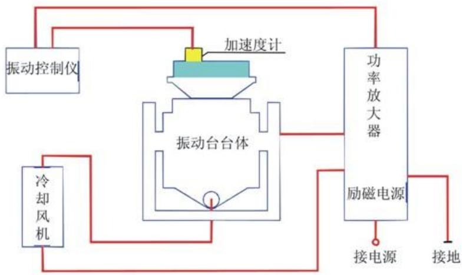  
图2.1 电振动台振动试验系统

振动台：振动试验系统的核心组成，主要承担对试验对象提供的振动运动以模拟振动环境，通过将在磁场中的线圈加载上交变电流以产生激振力来驱动台体振动，整个过程符合安倍定律。图2.2展示了电动振动台的结构原理简图，主要由运动部件（包含台面、动圈骨架、驱动线圈）、悬挂装置（包含悬挂弹簧、支撑柱）、磁极刚体（包含中心磁极、外磁极）、励磁线圈、支撑底座等构成。

功率放大器：振动控制仪器发出的控制电信号均是小功率信号，不足以驱动动圈进行振动运动，功率放大器便能将控制电信号功率放大的驱动动圈的工作功率，因此也被称为电动振动台的动力源。

加速度传感器：采集台面或控制点的加速度信号，以便控制仪进行闭环振动控制。加速度

传感器从电学原理可分为电感式、电动式、压电式、压阻式和涡流式，从力学原理可分为绝对式和相对式传感器，其中绝对式压电传感器因具有高精度、宽频带、动态范围广的特点而被经常采用。

水平滑台：目前大部分电动振动台都配备了液压支撑的水平油膜滑台，主要用于水平方向振动环境试验，其具有较高的可靠性、水平摩擦小、承受力矩大、支持高负载和低频振动试验的特点。

冷却装置：试验过程中线圈（包括驱动、励磁、消磁线圈）和短路环会产生大量热量，需要及时进行冷却，否则会影响设备性能。大型振动台常用的冷却方式有风冷却和液体（水或油）冷却，风冷却常用的冷却风向是从底部抽出、顶部进入的方式，液体冷却效果比风冷好得多，常用的方法是多闭路路并联循环液体冷却，冷却液能在管道中不断流通，冷却效果最佳。

振动控制系统：根据实验目的的不同，可将控制系统分为正弦振动控制和随机振动控制。正弦振动试验分为扫频试验和定频试验，扫频试验是根据设定的频带通过扫描方法不断更改激发频率。随机振动试验的频带比正弦振动宽，驱动谱是连续的频谱，能够同时提供所有在频带上的频率的激励。

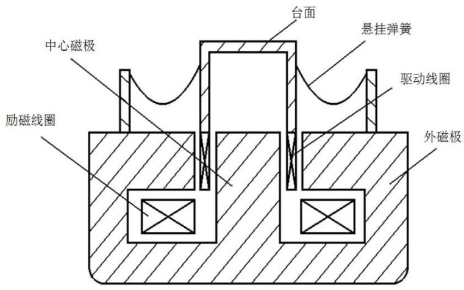  
图2.2 电动振动台结果原理简图

# 2.1.1 电动振动台运动部件

电动振动台的运动部件主要由台面（含骨架）和驱动线圈组成，这两个部件是决定振动台性能的关键，将这两个部件的组合称为动圈组合体，其一阶固有频率一般决定了整个振动台的工作频率上限，其阻抗特性对振动台和功放的匹配问题有直接联系。因此，一阶固有频率和线圈阻抗特性是设计电动振动台的主要问题。图2.2（a）为电动振动台动圈组合体实体图，其中

包含了台面、肋板、驱动线圈绕线骨架。

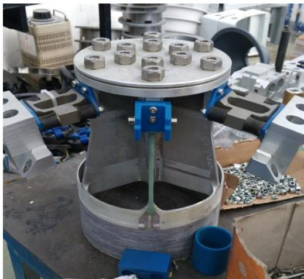  
(a) 实体图  
图2.3 动圈组合体实体图与二自由度等效力学模型

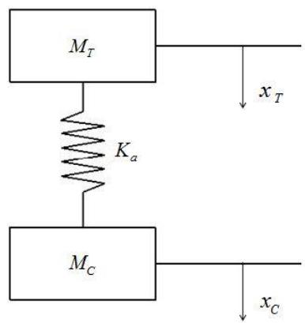  
（b）等效力学模型

由于电动振动台的整个运动部件即动圈组合体，是一个复杂的机械构造，对动圈组合体进行运动模型计算时需要做进一步的简化过程，以得到较为准备的结果，这里介绍一种二自由度力学模型的简化方式，如图2.3（b）所示。

假定动圈组合体的台面的质量为  $m_{1}$ , 周围肋板总质量为  $m_{01}$ , 与线圈连接部分的质量为  $m_{2}$ , 驱动线圈骨架的质量为  $m_{02}$ , 驱动线圈的质量为  $m_{3}$ , 图2.2中  $M_{T} 、 M_{C}$  是等效后的质量, 其中  $M_{T} = m_{1} + (m_{01} + m_{02} + m_{2}) / 2$ ,  $M_{C} = m_{3} + (m_{01} + m_{02} + m_{2}) / 2$  。同时假定台面的轴向拉压和弯曲刚度分别为  $K_{01} 、 K_{02}$ , 驱动线圈骨架和驱动线圈的轴向拉压刚度分别为  $K_{03} 、 K_{04}$ , 则能够推算出台面的刚度  $K_{1} = K_{01} \cdot K_{02} / (K_{01} + K_{02})$ , 线圈部分的刚度为  $K_{2} = K_{03} \cdot K_{04} / (K_{03} + K_{04})$ , 因此图2.2中的两个自由度之间的总刚度  $K_{a} = K1 \cdot K2 / (K1 + K2)$  。假定台面位移为  $x_{T}$  、驱动线圈位移为  $x_{C}$ , 则这一二自由度简化模型的运动方程为

$$
\left\{ \begin{array}{l} M _ {T} \ddot {X} _ {T} = K _ {a} \left(x _ {C} - x _ {T}\right) \\ M _ {C} \ddot {X} _ {C} = - K _ {a} \left(x _ {C} - x _ {T}\right) \end{array} \right. \tag {2.1}
$$

可求得其固有频率为

$$
f _ {0} = \frac {1}{2 \pi} \sqrt {\frac {K _ {a} \left(M _ {T} + M _ {C}\right)}{M _ {T} \cdot M _ {C}}} \tag {2.2}
$$

通过该简化二自由度模型计算得到的只是近似固有频率，在实际计算时还需要根据具体动圈组合体的结构特点、刚度和质量分布进行公式的修正计算。从上式仍可以看出，减少动圈组合体各个部分质量并增加其刚度，便能增大动圈组合体的固有频率以提高振动台的工作频率，因此厂家在制造电动振动台动圈骨架和台面时通常采用大比刚度的轻型合金材料，例如动圈的骨架采用镁铝合金材料，驱动线圈采用铝制导线烧制，同时尽可能减少动圈组合体各个部件的

尺寸，例如采用刚性肋板或者采用蜂窝式构造的方法。表2.1给出了动圈组合体常用的材料及其性能。从表中可以看出铍材料的性能最佳，但是铍材料价格非常昂贵且加工成本大，所以并不是最好的制造材料，大型的电动振动台通常采用铝合金材料。

表 2.1 常用动圈骨架材料及其性能  

<table><tr><td>材料</td><td>E(10^6 N / cm^2)</td><td>ρ(10^-2 N / cm^3)</td><td>E / ρ(10^8 cm)</td><td>热涨系数 (10^-6 °C^-1)</td></tr><tr><td>铝</td><td>7</td><td>2.5-2.8</td><td>2.8-2.5</td><td>24</td></tr><tr><td>钢</td><td>21</td><td>7-8</td><td>3-2.6</td><td>18</td></tr><tr><td>铍</td><td>30</td><td>1.85</td><td>16</td><td>12</td></tr><tr><td>陶瓷</td><td>38</td><td>3.7</td><td>10</td><td>7.8</td></tr></table>

驱动线圈可分为有骨架和无骨架两种，若采用骨架结构，因为导线表面的绝缘层刚度低，必须将导线牢固的粘贴在骨架上。同时骨架大多为筒形结构，在线圈通电后容易产生较大涡流，为了避免涡流的影响需要在骨架上切开多个竖直的开口。若采用的是无骨架结构，那么驱动线圈中的每个导线必须互相铰接牢固，甚至需要加上玻璃布衬层以提高其刚度。无骨架结构能够减小工作的气隙以便增强气隙中的磁感应强度，从而增加了激励的大小。

# 2.1.2 悬挂与导向装置

电动振动台通常均采用悬挂装置将运动部件悬挂于气隙磁场中，因其具有弹性，也称之为悬挂弹簧，对悬挂弹簧的选择要求主要包括：

(1) 弹簧的载荷-形变特性的线性度要好，滞后小，保证在振动台大位移的情况下有优秀的线性度，以避免采集点加速度波形的失真出现；  
(2) 在保证具有一定受载能力的情况下，尽可能降低其刚度，从而改善在低频振动下台面加速度波形的失真；  
(3) 需要较高的横向刚度和扭转刚度，避免台面进行横向和扭转运动；  
(4) 耐疲劳性能好，能够进行长期工作。

以上的要求中有一些是相互制约、矛盾的，全部满足这些要求在工程实际中难以实现，因此均会采用折衷的办法对悬挂装置进行设计、选择。悬挂弹簧的种类十分繁多，且各有利弊，工程制造采用的悬挂弹簧主要有组合式板簧和U形弹簧，以及其他的橡皮弹簧和摇臂弹簧等等。组合式板簧由径向和横向的两块板弹簧组合构成，并对称安装在电动振动台运动部件四周，这种板弹簧在横向方向上刚度较小，而在纵向方向上刚度大，其组成悬挂装置后会具备一定的导向作用。U形弹簧具有单片型和叠片型两种结构方式，单片型弹簧通常会套着高阻尼的橡胶以避免金属簧片的共振情况出现，其具有良好的弹簧性能且结构简单，另一种叠片型金属弹簧是通过将众多金属簧片叠加在一起形成的，金属簧片的共振会经过它们相互间的制约而消除，其

具有良好的弹性线性和限扭转性能。其他悬挂弹簧中，橡皮弹簧阻尼大但线性度差，圆盘形弹簧侧向刚度大，但不能加导向装置且受载小，适用于小型的振动台。

除了以上介绍的悬挂装置外，工程上仍可以采用通过负载辅助支撑和补偿的方法来使振动台运动部件处于气隙中的磁场中，例如薄膜气囊和采用增压气室的方法。

虽然有些悬挂装置具有导向作用，但仍需要安装导向装置进一步确保振动台的运动部分按照一定的方向运动，避免其产生横向和扭转运动而引起与磁极的碰触摩擦。通常采用的导向装置有直线轴承方式、滚轮方式、液体静压轴承方式等等。直线轴承导向装置具有体积小、便于安装的特点，但横向刚度低，仅限于中小型的振动台使用。滚轮导向装置具有较好的线性，但容易出现滑移情况，需要工程师经常调整。液体静压轴承导向装置具有大侧向刚度、高定位精度，且在高频段具有阻尼效果，适用于大型振动台，但加工复杂、精度要求高。

# 2.1.3 振动台台体隔振方式

在振动台运动部件进行振动运动时，动圈上的激励力会相应的施加到振动台的安装基础和支座上，支撑基础产生的振动会影响运动部件的振动特性并且对建筑地基会造成一定程度的破坏，而建筑抗震地基的成本十分昂贵，因此通常会在电动振动台支撑台体的耳轴和在支座的底部安装空气弹簧进行隔振。空气弹簧的隔振效果十分明显有效，其在  $8\mathrm{Hz}$  以上的隔振效率能达到百分之九十以上，建筑地基的共振频率大概在  $8 - 30\mathrm{Hz}$ ，因此无需再采用抗震地基，可以直接将振动台安放在普通地面上。

# 2.2 电动振动台工作频率特性

电动振动台工作的频率特性是由运动部件、悬挂系统、试验件以及磁路系统等因素决定的，由于构成电动振动台的实际结构质量和刚度分布十分复杂，为了方便分析，可以建立一个能够体现实际系统运动情况的集中参数模型，图2.4为等效后的电动振动台运动力学模型。

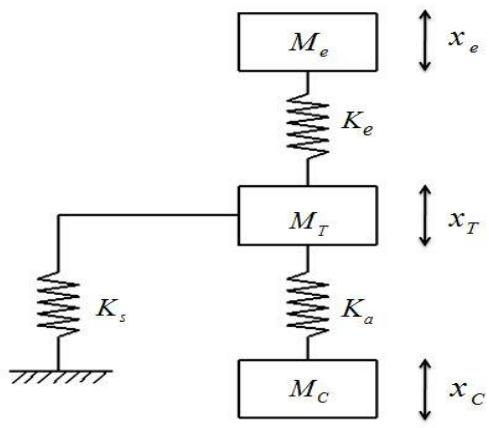  
图2.4 电动振动台运动力学模型

图中， $K_{s}$  为悬挂弹簧刚度， $K_{a}$  为线圈与动圈骨架之间的粘合刚度， $K_{e}$  为试验件与台面间连接刚度， $M_{e}$  为试验件的质量， $M_{T}$  为台体台面质量， $M_{C}$  为驱动线圈质量。通过集中质量和刚度参数后，其计算得到的共振频率值应与空载和负载下的振动台运动部分的实际共振频率相一致。

# 2.2.1 定驱动电压下的加速度频率特性

人为的将加载在驱动线圈两端的驱动电压保持恒定，此时驱动线圈中的电流大小变化只与线圈的电路阻抗有关，测得各个频率下台面的加速度与输入驱动电压的比值即为电动振动台的定压加速度频响特性。在进行加速度比电压传递函数推导前需要进行简化处理，假定台体为刚性体并取线圈的电阻值和电感值为均值，忽略分布电容对力常数（反电势常数）的影响。作了简化处理后可采用等效电路（即机电类比方法）的方法进行电动振动台振动特性分析。将图2.4中的运动力学模型转变成图2.5中的等效电路模型。

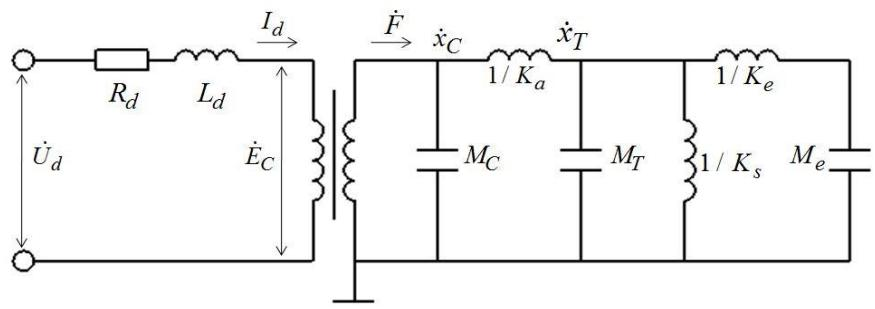  
图2.5运动模型等效电路图

该等效电路中，理想变压器匝数比即为力常数  $\Gamma = Bl$  ， $\dot{U}_d$  、 $\dot{I}_d$  分别为驱动线圈两端电压和线圈中电流， $\dot{E}_d$  是动圈运动产生的感应电动势， $\dot{F}$  为施加在驱动线圈上的电动力， $x_C$  、 $\dot{x}_C$  为驱动线圈的位移和速度， $x_T$  、 $\dot{x}_T$  分别为台面的位移和速度。为了分析方便，只讨论台面空载或者刚性负载的振动台频率特性，此时  $K_e$  远大于其他刚度值， $M_e$  可视为台面的一部分，于是电路中可忽略  $1 / K_e$  、 $M_e$  两项的影响，可列出以下方程式：

$$
\left\{ \begin{array}{c} \left(R _ {d} + L _ {d} S\right) \dot {I} _ {d} + \Gamma S x _ {C} = \dot {U} _ {d} \\ \left(M _ {C} S ^ {2} + K _ {a}\right) x _ {C} - \Gamma \dot {I} _ {d} - K _ {a} x _ {T} = 0 \\ \left(M _ {T} S ^ {2} + K _ {a} + K _ {s}\right) x _ {T} - K _ {a} x _ {C} = 0 \end{array} \right. \tag {2.3}
$$

式中，令  $S = j\omega$  ，台面加速度值为  $A$  ，则  $A = S^2 x_T$  ，由式（2.3）可得

$$
\frac {A}{\dot {U} _ {d}} = \frac {S ^ {2} \Gamma K _ {a}}{M _ {C} M _ {T} L _ {d}} \bigg [ S ^ {5} + \frac {R _ {d}}{L _ {d}} S ^ {4} + (\frac {K _ {a}}{M _ {T}} + \frac {K _ {s}}{M _ {T}} + \frac {K _ {a}}{M _ {C}} + \frac {\Gamma^ {2}}{M _ {C} L _ {d}}) S ^ {3}
$$

$$
\begin{array}{l} + \frac {R _ {d}}{L _ {d}} (\frac {K _ {a}}{M _ {T}} + \frac {K _ {a}}{M _ {C}} + \frac {K _ {s}}{M _ {T}}) S ^ {2} + (\frac {K _ {a} K _ {s}}{M _ {C} M _ {T}} + \frac {\Gamma^ {2} K _ {a}}{L _ {d} M _ {C} M _ {T}} + \frac {\Gamma^ {2} K _ {s}}{L _ {d} M _ {C} M _ {T}}) S \\ \left. + \frac {R _ {d} K _ {a} K _ {s}}{L _ {d} M _ {C} M _ {T}} \right] ^ {- 1} \tag {2.4} \\ \end{array}
$$

令  $\omega_{d} = R_{d} / L_{d}$  ；  $\omega_{q}^{2} = \Gamma^{2} / L_{d}M_{C}$  ；  $\omega_{s}^{2} = K_{s} / M_{T}$  ；  $\omega_{C}^{2} = K_{a} / M_{C}$  ；  $\omega_{t}^{2} = K_{a} / M_{T}$

则式（2.4）可转变为

$$
\begin{array}{l} \frac {A}{\dot {U} _ {d}} = \frac {S ^ {2} \omega_ {q} ^ {2} \omega_ {t} ^ {2}}{\Gamma} \Big [ S ^ {5} + \omega_ {d} S ^ {4} + (\omega_ {C} ^ {2} + \omega_ {t} ^ {2} + \omega_ {s} ^ {2} + \omega_ {q} ^ {2}) S ^ {3} \\ + \omega_ {d} \left(\omega_ {C} ^ {2} + \omega_ {t} ^ {2} + \omega_ {s} ^ {2}\right) S ^ {2} + \left(\omega_ {C} ^ {2} \omega_ {s} ^ {2} + \omega_ {q} ^ {2} \omega_ {t} ^ {2} + \omega_ {q} ^ {2} \omega_ {s} ^ {2}\right) S \\ \left. + \omega_ {d} \omega_ {C} ^ {2} \omega_ {s} ^ {2} \right] ^ {- 1} \tag {2.5} \\ \end{array}
$$

分解式（2.5）后进行化简可得

$$
\frac {A}{\dot {U} _ {d}} = \frac {1}{\Gamma} \frac {S ^ {2} \omega_ {2} ^ {2} \omega_ {3} ^ {2}}{\left(S + \omega_ {1}\right) \left(S ^ {2} + 2 \zeta_ {2} \omega_ {2} S + \omega_ {2} ^ {2}\right) \left(S ^ {2} + 2 \zeta_ {3} \omega_ {3} S + \omega_ {3} ^ {2}\right)} \tag {2.6}
$$

式中

$$
\omega_ {1} \approx \frac {R _ {d} K _ {s}}{\Gamma^ {2}}; \quad \omega_ {2} \approx \frac {\Gamma}{\sqrt {L _ {d} (M _ {C} + M _ {T})}}; \quad \omega_ {3} \approx \sqrt {\frac {K _ {a} (M _ {C} + M _ {T})}{M _ {C} M _ {T}}} ; \quad \zeta_ {2} = \frac {R _ {d}}{2 \Gamma} \sqrt {\frac {M _ {C} + M _ {T}}{L _ {d}}}
$$

$\zeta_{3}$  的值由驱动线圈和动圈骨架连接部的结构阻尼决定。

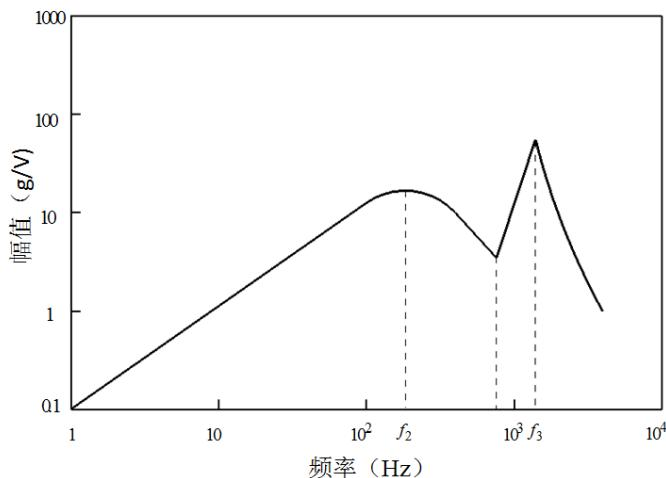  
图2.6典型恒定驱动电压下加速度幅频特性

图2.6为电动振动台恒定驱动电压下的典型台面加速度幅频特性，图中显现不出  $\omega_{1}$  对应的一阶共振峰， $\omega_{2}$  对应的共振峰出现在图中中频区段，通常也称之为电谐振频率，因其是由于驱动线

圈的阻抗和感应电动势共同造成的， $\omega_{3}$  即为电动振动台运动部分的一阶固频，对应的共振峰出现在高频段。

当台面的负载为弹性负载时，可将图2.5中的  $1 / K_{e}$  、  $M_{e}$  带入式子中进行分析计算，用上述类似的推导方式便能到到定压下的台面加速度传递函数，此处就不再做详细推算。

# 2.2.2 定驱动电流下的加速度频率特性

当驱动电动振动台工作的功率放大器具有相当高的输出内阻时，驱动线圈电路中的电流会处于一个保持稳定的状态，在这个状态下电流值的的大小变化与驱动线圈的阻抗和感应电动势无关。测得各个频率下台面加速度与输入驱动电流的比值即为电动振动台的定电流加速度频响特性。进行加速度比电流的传递函数推导仍可采用之前的机电类似法，现假定的条件和计算符号与之前一样，只需在图2.5中的恒压源替换为恒流源。经过理想变压器之后，次级电流  $F$  即振动台激励力也是保持不变的，其大小为  $\Gamma I_{d}$ ，根据式（2.3）可以推导得

$$
\frac {x _ {T}}{\dot {I} _ {d}} = \frac {\Gamma}{M _ {C} + M _ {T}} \cdot \frac {\omega_ {m} {} ^ {2}}{S ^ {4} + \left(\omega_ {m} {} ^ {2} + \frac {K _ {s}}{M _ {T}}\right) S ^ {2} + \omega_ {m} {} ^ {2} \omega_ {s} {} ^ {2}} \tag {2.7}
$$

式中， $\omega_{m}$  为电动振动台运动部分的一阶固频， $\omega_{s}$  为悬挂系统固有频率。

$$
\omega_ {s} = \sqrt {K _ {s} / (M _ {C} + M _ {T})}
$$

令加速度  $A = S^{2} x_{T}$ , 且  $K_{s} / M_{T} \ll \omega_{m}^{2}$ , 由上式可得

$$
\frac {A}{\dot {I} _ {d}} \approx \frac {\Gamma}{M _ {C} + M _ {T}} \cdot \frac {1}{1 - \left(\frac {\omega^ {2}}{\omega_ {m} {} ^ {2}} + \frac {\omega_ {s} {} ^ {2}}{\omega^ {2}}\right)} \tag {2.8}
$$

图2.7为电动振动台恒定驱动电流下的典型台面加速度幅频特性，图中在中低频段和高频段的两个共振峰对应的频率即为式(2.8)中的  $\omega_{s}$  和  $\omega_{m}$ ，按图中曲线特性可分为四个区域，其中  $A$  区为恒位移区（或刚度控制区），此时由于  $\omega$  远小于  $\omega_{s}$  和  $\omega_{m}$ ，式（2.8）可表示为

$$
\frac {A}{\dot {I} _ {d}} \approx \frac {\Gamma \omega^ {2}}{(M _ {C} + M _ {T}) \omega_ {s} ^ {2}}
$$

从上式可以看出当电流恒定时，加速度幅值和频率的平方成正比关系，曲线大致为一直线。  $B$  区为低频共振区，此时  $\omega = \omega_{s}$ ，在该频段内运动部件和支撑悬挂系统发生共振现象，一般在支撑悬挂系统中加入一定大小阻尼，以便削弱此处的共振峰值大小。  $C$  区为恒定加速度区（或质量控制区），此时  $\omega_{s} \ll \omega \ll \omega_{m}$ ，式（2.8）可表示为

$$
\frac {A}{\dot {I} _ {d}} \approx \frac {\Gamma}{(M _ {C} + M _ {T})}
$$

从该式看出当电流保持恒定时，加速度值也保持恒定，曲线为一水平线。 $D$  区为高频共振区，此时  $\omega = \omega_{m}$ ，电动振动台的运动部分产生一阶共振现象，当加负载时会改变此共振频率大小。当  $\omega >> \omega_{m}$  时，式（2.8）可表示为  $A / \dot{I}_{d} \approx \Gamma \omega_{m}^{2} / [(M_{C} + M_{T})\omega^{2}]$ ，曲线呈快速下降趋势。

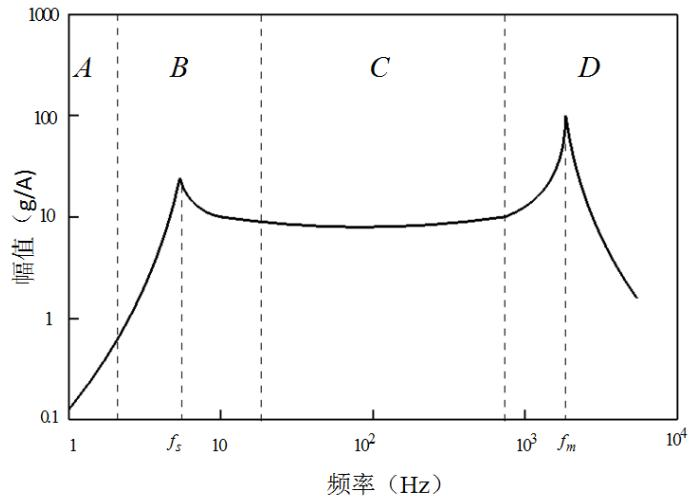  
图2.7典型恒定驱动电流下加速度幅频特性

从该幅频特性曲线可以看出，电动振动台的主要工作频段处于  $C$  区，若能够通过增加支撑悬挂装置的阻尼来降低低频共振区的共振峰值，工作频段可降至  $B$  区，但在低频段长时间进行振动试验会对振动台台体产生极大磨损，降低工作寿命，故工程中应减少其低频工作时间或避免其进行低频工作。

# 2.3 电动振动台主要性能参数

# 2.3.1 工作频带和额定推力

为了在保证波形失真度低的情况下提高振动台的工作寿命，电动振动台的工作频带下限（即最大位移工作频率下限）应高于振动台悬挂装置的共振频率，工作频带上限（即最大加速度工作频率上限）应低于振动台运动部分一阶固频。

额定推力是电动振动台所能提供的最大推力，其大小通过公式  $F = (M + M_e) \cdot A$  计算获得，其中  $M$  、  $M_e$  分别为振动台运动部分质量和试验件质量，  $A$  为试验件加速度最大幅值。

# 2.3.2 加速度幅值均匀度和波形失真度

加速度幅值均匀度表现的是指在某次测试试验中，测试台面除中心点外各个测量点加速度幅值大小对于测试台面中心点加速度幅值的偏差情况，其值可通过下式表示

$$
N _ {A} = \left(\left| \Delta a _ {\max } \right| / a _ {z}\right) \times 100 \% \tag{2.9}
$$

式中， $\Delta a_{\mathrm{max}}$  ---除中心点外测量点加速度幅值相对中心点加速度幅值最大偏差值

$a_{z}$  ---- 振动台台面中心点加速度幅值

加速度波形的失真度是在空负载和工作频带内测量的加速度波形失真的最大值，具体测量方式可通过失真度测量仪，也可通过频率分析仪测出某频率上加速度  $N$  次谐波幅值和基波幅值，并采用下式进行计算

$$
\gamma = \frac {\sqrt {U _ {2} ^ {2} + U _ {3} ^ {2} + \cdots + U _ {n} ^ {2}}}{U _ {1}} \times 100 \% \tag{2.10}
$$

式中， $U_{1}$ ----基波幅值

$U_{n}$  ----第  $n$  次谐波的加速度幅值

# 2.3.3 横向振动比

电动振动台台体在振动过程中，尽管有导向装置的方向固定作用，但难免会在垂直于工作振动方向产生振动分量。横向振动比就是衡量垂直于工作振动方向的振动分量大小程度，计算方式由下式给出

$$
T S R = \frac {\sqrt {a _ {x} ^ {2} + a _ {y} ^ {2}}}{a _ {z}} \times 100 \% \tag{2.11}
$$

式中， $a_{z}$  ——为工作振动方向的加速度幅值大小

$a_{x}$  、  $a_{y}$  ----为该次测量中垂直于工作振动方向的两个振动分量加速度幅值大小

# 2.4 本章小结

本章重点介绍了电动振动台的系统组成及其各个结构、装置的主要功能用途，并采用机电类比的方式详细分析了电动振动台在恒定驱动电压和恒定驱动定流下的加速度工作频率特性。最后简单介绍了衡量电动振动台性能优劣的一些重要参数及其计算方式。

# 第三章 虚拟振动环境试验构建方法

虚拟振动环境试验分析能够在实际具体试验之前尽可能得到试验件在该振动环境下的响应信息及各点的应力应变情况，能够及时发现并解决试验中容易出现的问题，避免重复的工作量，同时降低了试验成本，例如针对大型试验件的环境试验等。

虚拟振动环境试验系统模型是在多种计算机软件建模环境下联合建立而成，主要包含振动台振动环境机电模型的建立、结构试验件有限元模型的建立以及振动控制系统的建立。在各类计算机软件中分别建立以上的模型和系统，并通过装配、信号口对接，形成完整的虚拟振动环境系统仿真模型。

# 3.1 虚拟振动环境试验建立主要流程

根据第二章介绍分析的电动振动台系统组成，虚拟振动环境试验系统主要包含以下几个部分：电动振动台的机械构造（台面、动圈组合体以及支撑悬挂系统）、电动振动台电磁驱动系统、产品试验件有限元模型以及闭环振动控制仪系统。针对虚拟振动环境试验的系统组成，具体的模型、系统建立流程如下：

# 1)电动振动台机械模型的建立

电动振动台的机械构造相对复杂，一般建立其运动模型采用集中质量参数的方法，将其运动部件当作刚性体处理。较为准确的电动振动台运动部件运动模型是三自由度运动模型，将台面、驱动线圈以及支撑悬挂装置设定为三个集中质量刚性体，各个刚性体之间通过弹簧以及阻尼器相连接。其中支撑悬挂装置由基座(地面)支撑，台面通过弹簧悬挂在支撑悬挂装置上，而驱动线圈粘附在台体的动圈骨架上（粘附连接处可视为刚度极大的弹簧）。

# 2）产品试验件有限元模型的建立

产品试验件通过有限元软件建立其有限元模型后，需要与振动台进行刚柔耦合建模，虚拟振动试验中其各个节点响应情况和试验件各个部分应力应变情况都能通过软件获得。为了得到较高的仿真精确度，要求产品试验件的有限元模型应真实、准确，因此在建立该模型后，大多需要通过实际模型的模态识别试验对该模型进行修正改进，保证该有限元模型与实际试验件具有相一致的模态特性和结构特性。对模型进行优化后再与电动振动台机械模型进行最后的刚柔耦合集成，并通过有限元分析软件计算出其各个模态结果。

# 3）电动振动台电磁作动系统模型的创建

电动振动台机械模型一般在建模、画图软件中建立，例如CATIA建模软件等，电磁作动系统处理的是输入电压信号、电磁力与台体运动部分运动速率相互之间的关系，一般在信号处

理软件中进行，常用的软件是 AMESim 和 matlab/simulink。电磁作动模型建立后再与电动振动台机械模型进行数据接口对接，实现软件间的数据信号传输。

# 4）闭环振动控制系统的建立

振动控制系统的作用主要在于模拟驱动电压信号的发出以及通过采集和处理后的控制点的加速度信号对输入信号进行修正，使控制点的加速度响应符合预期要求。根据振动环境试验目的的不同可分为正弦振动控制系统和随机振动控制系统等等。在进行闭环振动控制之前需要对输入输出物理量（本文为加速度与电压信号）进行频响函数计算，通过该频响结果计算输入信号的初始值并进行预加载，随机振动控制算法将在下一章节进行详细叙述。闭环振动控制系统可在matlab/simulink软件环境中建立，并实现与电动振动台机械模型的信号接口的对接。

# 5）联合建立的系统模型进行仿真振动试验

将前四个流程步骤建立的系统模型进行最后的集成，运行振动控制系统进行仿真振动环境试验。仿真结束后得到产品试验件有限元模型在整个试验过程中各个点的响应情况，以及各个时刻下试验件模型的应力应变分布，分析不合实际情况下的响应和应力应变分布，对系统模型进行优化修正。

# 3.2 构建虚拟环境试验系统的软件功能介绍

由虚拟振动环境试验仿真模型建立的流程可知，系统模型的建立涉及到CATIA建模、多体运动建模、有限元建模、电磁作动系统仿真、振动控制系统仿真、模型修正等学科，在国内现有的条件下需要通过多种软件进行联合仿真，主要途径是通过各个具有相关功能的商业软件进行各部分的模型和系统建立，并开发出软件之间的数据对接接口，实现虚拟振动环境试验的联合仿真系统建立的完成。此外还有一种直接采用多学科联立仿真的软件平台的方法，避免了多种软件间复杂的数据传输过程。按现有的条件，该方法目前难以满足，本文仍然采用多学科多软件联合仿真建模的方法。

本文采用CATIA软件进行电动振动台机械模型的建模工作，利用MSCPatran/Nastran进行产品试验件有限元模型的建立和模型修正，并采用LMSVirtual.Lab软件进行多体运动模型的装配以及电动振动台台体、夹具、产品有限元模型间的刚柔耦合模态分析，Matlab/Simulink和Stateflow模块进行电磁作动系统仿真模型和随机振动控制系统的创建。最后进行各个软件间的数据接口对接，形成完整的虚拟振动环境系统。

# 3.2.1 LMS Virtual.Lab 软件功能介绍

Virtual.Lab 是一种包含多学科集成的三维建模系统仿真软件，三维建模环境继承了 CATIA 的建模体系，零件、模型文件间能够实现直接的界面切换，无需进行件类型的转换和修改。除此之外，Virtual.Lab 还包含了结构设计、振动与声学分析、多体运动、结构疲劳分析以及混合

模块仿真等功能，并且完全集成了LMS试验系统，能够实现基于试验分析的结果与虚拟环境仿真系统的结合，可以对仿真系统进行修正，提高仿真真实度。与其他的3D建模仿真软件相比，Virtual.Lab具有以下功能特点：

1）包含了多学科系统仿真分析功能。Virtual.Lab 提供了一个多学科集成仿真的虚拟实验软件平台，提供振动与声学、多体机械运动、结构疲劳、混合模块仿真、设计优化、力学分析、结构安全与耐久性等等分析功能。  
2）集成了CATIA建模系统，并能够与CAD、CAE等文件完整连接，无需文件类型和数据转换。在CATIA、CAD等软件中建立的模型可直接通过Virtual.Lab打开，避免了重复建模工作。  
3）提供了与多种数据分析、编程的软件数据传输的对接接口，提供了多种软件联合仿真的可能性。Virtual.Lab能够实现与AMESim和Matlab/Simulink的联合仿真，并且其建立的刚柔耦合模型能够通过MSC Nastran进行模态分析。  
4）具有重复再现仿真分析可视化过程的功能。虚拟试验仿真结束后，Vitrual.Lab 保存了仿真过程中产品试验件的时域响应过程，并能够实现多次的仿真过程的再现，避免了重复试验，节省了大量时间成本。

Virtual.Lab 集成了 CATIA 系统多个工作平台，并由此衍生出多学科联合仿真分析的功能，其主要包括了如下工作平台：

# 1）结构分析平台(Virtual.Lab Structures)

由于Virtual.Lab 集成了CATIA的建模分析系统，在结构分析平台中可进行产品试验件的结构设计以及有限元模型的网格划分（有限元模型也可采用MSC Patarn进行建模并导入VL中），但Virtual.Lab 缺少有限元分析模块，在进行模态分析时需要调用第三方有限元求解器，如常用的MSC Nastran。产品试验件各个零件的装配也能够在此平台中进行，且零件的几何特征能够在该平台上直接修改，节省大量重复建模时间。

# 2）多体动力学分析平台(Virtual.Lab Motion)

VL Motion 用于确定系统机械模型中各个构件之间的运动约束关系，并提供仿真系统的载荷输入接口以及机械运动物理量输出接口。VL Motion 提供各种模拟机械运动的运动副模型、力模拟模型，运动副用于定义零件相互间的运动约束关系，力模拟模型（如弹簧阻尼器）用于模拟零件之间的运动力学关系。此外，VL Motion 平台提供系统模型外载荷输入点和运动物理量（如位移、速度、加速度）输出点的设定，通过输入输出点实现与其他软件的数据接口对接。在进行多体运动模型创建时，可直接通过该平台建立，也可通过其他平台进行模型建立并导入到 VL Motion 中。

# 3）声学分析平台(Virtual.Lab Acoustics)

VL Acoustics 集成了 LMS SYSNOISE 试验仿真分析技术，提供完整的声学性能分析试验模拟环境，在此平台能够实现从产品设计、改进到基于实际试验的验证等过程。VL Acoustics 声学分析应用范围包括声场和声辐射模拟、流体噪声分析、随机振动噪声分析等等领域，可帮用户实现声学原理分析、产品设计修改影响预测以及吸声降噪等目标。

# 4）NVH仿真平台(Virtual.Lab NVH)

Virtual.Lab NVH平台主要用于模拟产品工作环境下振动噪声分析试验，通过混合模型系统的建立、工作环境的模拟，仿真计算多系统各个零部件的振动噪声情况。VL NVH提供混合建模功能，模型的建立可通过有限元和试验模型相结合，并可模拟真实的工作环境。在专业的振动噪声求解器的快速精确的计算下，利用此平台模拟出产品系统在工作条件下的振动噪声响应，基于该结果进行产品的修正改进。

# 3.2.2 Matlab/Simulink 软件功能介绍

Matlab 计算软件具有语言易学、库函数丰富、适合数学模型仿真等特点，已成为如今最受工程师欢迎的计算软件，其应用领域覆盖了航空、航天、汽车、电子、控制、通信等等。在项目开发和完善过程中，使用 Matlab 能够提高设计效率、节约时间成本、缩短试验周期、降低试验成本，因此掌握 Matlab 的使用方法已经成为一种研究工程师的必备技能。

Matlab 计算软件是由美国 MathWorks 公司开发的一种具有多方用途的集成软件，可用于项目开发、算法实现、建模仿真、实时过程等研究工作，并在数学计算、系统仿真、图像数字信号处理、现代控制系统、电子信息工程应用、生物医学等研发领域中成为不可或缺的计算软件设计工具。Matlab 编程运算的逻辑思路与科学计算的表达方式较为相似，因此编程语言简单易懂，具有用法易学、运用灵活、编程程序结构完整且具有优秀的可移植性等特点。

Matlab 主打矩阵运算，其基本元素便是不需要初始化维数的矩阵，并提供涉及到多种学科的矩阵函数以及特殊用途库函数使用，在解决信号分析处理问题、建模仿真问题、系统识别问题、控制和算法优化等问题时能明显体现出高效、简便的优势。

# 1）Simulink图形化仿真平台

Simulink是Matlab产品体系的发展过程中产生的一个重要的图形仿真平台，是Matlab计算软件提供的用于动态实时系统建模仿真分析的高度集成软件包，能够与Matlab平台进行无阻碍的交互连接。Simulink建立的仿真系统是通过图形模块进行描述，然后采用Matlab求解器进行时域仿真运行。其主要仿真的系统模型包含线性系统和非线性系统、离散系统和连续系统、混合系统以及多任务事件系统等，且具有众多涉及多个学科领域的仿真工具箱和专业模块包。

Simulink 中提供多种各式各样的内置仿真模块，方便用户进行系统模型的快速建立。

Simulink 内置的模型库主要分公共的和专业的两种，其中公共模型库是最常用的，适用于各种

学科专业，包含常用模块（Commonly Used Blocks）、连续系统模块（Continuous）、不连续环节模块（Discontinuities）、离散系统模块（Discrete）、数学运算模块（Math Operation）、输出方式模块（Sinks）、输入源模块（Source）等16种子模块库。专业模型库是针对不同专业、不同领域而建立的，主要包含航空航天模块（Aerospace Blockset）、控制系统工具模块（Control System Toolbox）、数字信号处理模块（DSP Blockset）、Simulink附加模块（Simulink Extra）、状态流模块（Stateflow）、通信模块（Communication Blockset）等13种专业型模块库。

Simulink仿真过程主要包含四个步骤：创建仿真系统模型，在模型库中选择需要的模块到Simulink界面内，并通过连线将各个模块联系完整；设置系统各个模块参数，每个模块参数都具有缺省值，用户可根据需要重新进行数值参数设置；设置系统仿真参数，打开SimulationParameters对话框进行仿真时间、步长以及求解器类型等参数的设定；运行仿真系统，在设置各种系统参数后开始仿真过程，得到系统仿真结果。

# 2）Stateflow（状态流）模型仿真工具

此外，MathWorks公司还在Simulink平台中开发出用于建立包含逻辑性强的复杂事件的仿真系统建模工具——Stateflow，通常也称之为状态流。通过Stateflow平台，用户可对复杂事件的逻辑行为进行模块化建模，实现各种条件状态的互相转换，并能够与Simulink建立的动态系统仿真模型进行无缝结合。

Simulink 在仿真初始化时前会启用编译器对 Stateflow 图形模块进行代码转换，形成 C 格式的 S-函数（Mex 格式文件），产生的仿真目标在 Stateflow 中定义为 Sfun 目标，仿真过程中可直接调用并将两者结合为一个仿真系统。在 Simulink 进行代码转换时，Stateflow 会在当前工作目录中产生一个 sfpri 文件目录，仿真过程中产生的文件都存储在该目录中。

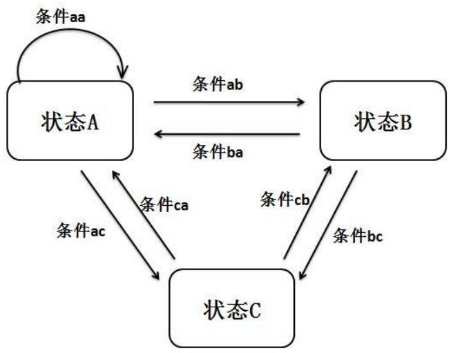  
图3.1Stateflow仿真原理示意图

Stateflow 是基于“FSM（Finite State Machine 有限状态机）”原理开发的图形化仿真工具。

“FSM（Finite State Machine 有限状态机）”原理内容为系统存在多种状态，当某件事件发生后，系统从当前运行的状态按事件发生后的规定路线转换到指定状态，故也称其为事件驱动系统。利用该原理，Stateflow 允许用户采用图形化的方式自行创建多个系统状态，并设定每两个状态之间相互转换的状态迁移事件，从而构造出完整的有限状态转换系统。

图3.1展示的是Stateflow的仿真原理示意图，其中包含ABC三种状态，且各个状态互相之间都存在迁移转换条件，A存在自行转换状态条件，例如当此时仿真系统处在状态A时，当触发条件aa时，则系统仍保持状态A，当触发条件ab时，仿真系统从状态A转换到状态B。每个状态事件和事件迁移条件都是由用户自行设置。一般将Stateflow仿真系统嵌入到Simulink仿真模型中，其触发状态迁移事件可来自Stateflow自身系统内部，也可来自Simulink仿真系统模型。将Stateflow和Simulink结合使用能使仿真系统更为灵活、更具有逻辑和事件控制能力，利用Stateflow能够实现：对基于“FSM（有限状态机）”原理的复杂事件系统进行图形式的仿真建模；测试等控制系统的开发设计；在产品系统不同设计阶段性能的修正、改进以及验证；设计中整数、浮点等代码的自动产生（此功能需要编码器实现）；与Matlab/Simulink更好的结合，并进行系统的建模仿真分析。

# 3.2.3 LMS Virtual.Lab 与 Matlab/Simulink 联合仿真

构建虚拟振动环境试验平台时需要考虑到其振动台的机械运动、电磁作动以及振动控制系统的相互作用，当采用多种软件进行仿真系统构建时便需要解决软件进行系统数据交互的问题。LMS Virtual.Lab 和 Matlab/Simulink 能够提供这种实现数据交互功能的联合仿真方式。

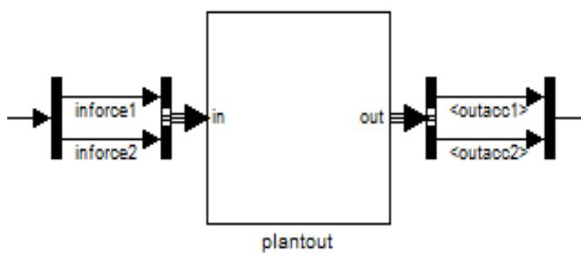  
图3.2VL与Simulink联合仿真机械动力系统模块

在计算机安装 LMS Virtual.Lab 时同时安装与 Matlab 的数据对接接口，此时会产生 Matlab Motion 选择项，在启动 Virtual.Lab 的同时也会启动该模块。数据接口对接的主要流程为：首先在 VL 机械结构设计平台中选择产品试验件特定的一些点为激励输入控制点以及物理量（速度、位移、加速度等）输出控制点，同时也可添加一些位移、速度监测控制单元；选择求解积分方式（Method Integration）为 MATLAB SIM 或 MATLAB COSIM；求解计算 Solution.set 得到一

个Matlab可识别的plantout.m文件，打开Simulink后运行该文件，最终获得一个具有输入和输出通道的仿真图形模块，如图3.2所示。

图3.2中系统模块的输入即为电动振动台动圈激励力的输入，输出点可设为台面和动圈速度、加速度等。分析动圈激励力和速度等物理之间的电磁作用下的关系，利用Simulink仿真模块进行图形化数字建模，实现电磁作动系统模型的建立，并结合Stateflow和Simulink平台建立振动控制系统模型，最后联立机械动力模型、电磁作动系统和振动控制系统完成虚拟振动环境试验仿真系统的完成。

# 3.3 构建虚拟振动环境系统的线性有限元法

构建虚拟振动环境试验的线性有限元法考虑电动振动台各个组成部分的振动模态影响，不进行电动振动电磁作动系统的建立，本质是将振动台和产品试验件当作一个总的有限元模型进行受迫振动分析。

构建虚拟振动环境试验的线性有限元法流程框图如图3.3所示，具体步骤为：

1）分别建立振动台台体、动圈骨架、支撑基座等各个子部件的有限元模型；  
2）进行振动台各个子部件的组装，根据实际情况进行装配方法的选择，例如约束条件、节点合并、单元连接等；  
3）对装配完成的振动台有限元模型进行模态分析，并根据其动态特性进行修正；  
4）建立产品试验件的有限元模型，进行模态特性等分析，并根据实验测得的模态特性进行模型修正；  
5）将产品试验件模型安装到振动台模型上，并进行夹具、连接处的节点修正，形成完整的振动试验有限元模型的创建；  
6）对完整的振动台和产品试验件有限元模型进行受迫振动响应分析，得到仿真试验结果。

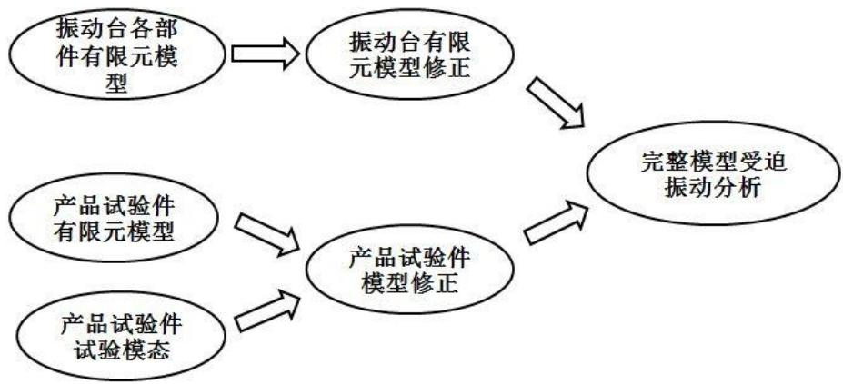  
图3.3有限元法系统流程框图

# 3.4 本章小结

本章首先介绍了虚拟振动环境试验系统建立的主要流程，主要采用多种软件进行多个仿真系统的模型建立；然后简要讲解了建立虚拟振动环境试验系统的两种软件功能用法，并分析了其联合仿真的可行性；最后介绍了创建虚拟振动台试验的线性有限元法，列出了采用该方法进行仿真建模的流程。

# 第四章 基于Matlab/Simulink的MIMO随机振动控制

本章将主要介绍建立多输入多输出（MIMO）虚拟振动环境试验控制系统的基础理论，并对梁模型进行多输入多输出随机振动控制虚拟试验，以验证建立的振动控制系统的可行性和有效性。

多输入多输出（MIMO）随机振动控制系统的建立是进行虚拟振动环境试验最为重要的环节之一，其采用频谱再现的方式，基于多输入多输出随机振动控制算法对输出信号进行频域信号控制，使控制点的响应谱和参考谱保持相对一致。试验控制系统的控制目标一般为控制点的加速度功率谱密度矩阵，因此需要进行频域和时域信号之间的互相转换，转换过程中频响估计误差、信号测量误差、控制算法修正误差等都会影响最后的响应功率谱矩阵控制结果。

根据振动台数目与控制点数目的不同可分为三种控制方式（方阵控制、长方阵控制和最小能量控制），本文研究的主要是振动台数目与控制点数目相同的工程情况，所求的驱动谱修正矩阵具有唯一性，属于方阵控制。假定一个多输入多输出随机振动响应系统  $G$  具有  $N$  个输入点和  $N$  个输出点，系统的输入信号即激励信号可用列向量  $X = [x_{1}, x_{2}, \dots, x_{N}]^{T}$  表示，输出信号即响应信号可用列向量  $Y = [y_{1}, y_{2}, \dots, y_{N}]^{T}$  表示，以响应信号的功率谱作为控制目标，可用  $S_{yy}$  表示，根据线性振动理论可以得到：

$$
S _ {y y} = G S _ {d d} G ^ {H} = R \tag {4.1}
$$

式中， $G$  为系统频响函数矩阵， $H$  表示矩阵的共轭转置， $S_{dd}$  为输入信号功率谱矩阵， $R$  为设定的参考谱矩阵，由上式可推导出：

$$
S _ {d d} = G ^ {- 1} R G ^ {- H} \tag {4.2}
$$

令  $A = G^{-1}$  ，即系统  $G$  的补偿矩阵，代入式（4.2）可得：

$$
S _ {d d} = A R A ^ {H} \tag {4.3}
$$

分别对式（4.3）中的  $S_{dd}$  和  $R$  进行Cholesky分解：

$$
S _ {d d} = D D ^ {H} \tag {4.4}
$$

$$
R = L L ^ {H} \tag {4.5}
$$

上面几个式子中参考谱  $R$  是用户自行设定的，因此  $L$  可直接由  $R$  求解得到，而驱动谱  $S_{dd}$  未知，但根据 Cholesky 分解计算的唯一性，可以联立式（4.3）、（4.4）和（4.5）得出输入信号功率频谱矩阵  $D$  为：

$$
D = A L \tag {4.6}
$$

通过求得的输入信号频谱矩阵  $D$  计算出真随机驱动信号  $X$ ，将驱动信号  $X$  输入到对应的振动台从而对产品试验件进行激振，使产品试验件在设定的振动环境下进行响应分析。通过传感器

测量采集控制点响应信号  $Y$ ，根据响应信号  $Y$  求解可得控制点的响应谱矩阵  $S_{yy}$ ，校验响应谱矩阵  $S_{yy}$  是否在参考谱  $R$  的容差限内，采用控制算法计算控制修正因子并对驱动谱进行修正，经过多次循环修正后使控制点的响应谱达到要求。

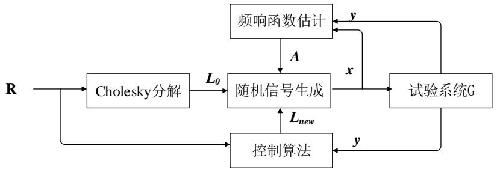  
图4.1 MIMO随机振动控制系统流程框图

MIMO随机振动控制系统控制流程框图如图4.1所示。图中展示出影响控制结果的最为重要三个因素：频响函数估计方法、随机信号生成方式以及控制修正算法。

# 4.1 频响函数估计方法

对于一个具有  $N$  输入和  $N$  输出的MIMO系统G，通常采用矩阵的形式表示其频响函数，矩阵中每一个元素均是频率的函数，具体可表示为

$$
G = \left[ \begin{array}{c c c c} g _ {1 1} & g _ {1 2} & \dots & g _ {1 N} \\ g _ {2 1} & g _ {2 2} & \dots & g _ {2 N} \\ \vdots & \vdots & \vdots & \vdots \\ g _ {N 1} & g _ {N 2} & \dots & g _ {N N} \end{array} \right] \tag {4.7}
$$

式中， $g_{ij}$  为频率的函数。若输入信号为  $X = [x_1, x_2, \dots, x_N]^T$ ，输出信号为  $Y = [y_1, y_2, \dots, y_N]^T$ ，经傅里叶变换转换为频率的函数，此时  $X(\omega)$ 、 $Y(\omega)$ 、 $G(\omega)$  满足

$$
Y (\omega) = G (\omega) X (\omega) \tag {4.8}
$$

在实际频响计算中，测量得到的输入信号和输出信号都难免会收到噪声污染，因此选择合理的频响函数估计方式对提高振动控制的效果尤为重要。一般根据噪声假设位置的不同可将频响函数估计分为  $H_{1}$  估计模型（输出噪声模型）、 $H_{2}$  估计模型（输入噪声模型）和  $H_{\nu}$  估计模型（输入输出噪声模型）。本文采用  $H_{1}$  估计模型，假设只有输出信号端有噪声污染，输出噪声用  $N$  表示，则此时  $N$  与输入信号  $X$  、输出信号  $Y$  的关系可用下式表示：

$$
Y = G X + N \tag {4.9}
$$

在式（4.9）两端同时乘以  $X^{H}$ ， $H$  表示共轭转置，再求两端的数学期望得：

$$
S _ {y x} = G S _ {x x} + S _ {n x} \tag {4.10}
$$

式中， $S_{yx}$  表示的是输入信号与输出信号的互功率谱密度， $S_{xx}$  表示的是输入信号的自功率谱密度， $S_{nx}$  表示的是输出噪声与输入信号的互功率谱密度，假定输出噪声与输入信号互不相干，

则  $S_{nx} = E(N,X^H) = 0$  ，由式（4.10）可推导得：

$$
G _ {1} = S _ {y x} S _ {x x} ^ {- 1} \tag {4.11}
$$

式中， $G_{1}$  即为采用  $H_{1}$  估计模型得到的频响函数计算结果。

# 4.2 随机输入信号的生成

由于驱动谱提供的是频域内的信号特性，不能直接用于时域内的输入信号，需要采用随时信号生成办法进行频域和时域的转换，目前常用的方法是由Tebbs提出的时域随机化法。时域随机化法包含两个步骤：第一个是生成一帧伪随机输入信号，第二个是通过时域随机化生成多帧真随机输入信号。

根据式（4.6）计算得到的驱动频谱  $D$  可以通过逆傅里叶变换得到一帧伪随机输入信号，进行变换前需要补充相位信息  $P$ ：

$$
P = \left[ \begin{array}{c c c} e ^ {j \theta_ {1}} & & \\ & \ddots & \\ & & e ^ {j \theta_ {N}} \end{array} \right] \tag {4.12}
$$

式中，  $j = \sqrt{-1}$  表示虚数单位，  $\theta_{i}(i = 1\dots N)$  为均匀分布在  $[-\pi ,\pi ]$  的随机相位值。因此，  $P$  满足：

$$
P P ^ {H} = I \tag {4.13}
$$

将相位信息矩阵  $P$  代入式（4.6）可得：

$$
D = A L P \tag {4.14}
$$

对驱动频谱  $D$  进行逆傅里叶变换可得到一帧伪随机输入信号  $d$  :

$$
d = i f f t (D) \tag {4.15}
$$

经过逆傅里叶变换得到的伪随机输入信号  $d$  长度有限，不能直接用于激励信号进行随机振动试验，还需要经过时域随机化过程产生长度足够的真随机输入信号，随机化过程包含随机正反向延拓、随机抽取起始点和加窗延时叠三个主要部分，假定一帧伪随机信号长度为  $T$  ，其流程框图如图4.2所示。

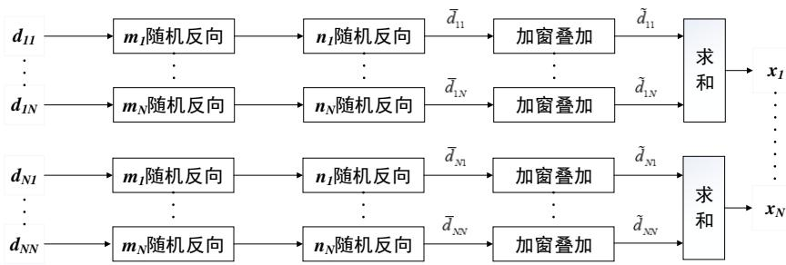  
图4.2时域随机化过程框图

图中  $N$  表示驱动矩阵的维数,  $m_{j}(j = 1 \dots N)$  为 1 和 -1 的随机数 (1 表示正向延拓, -1 表示反向延拓),  $n_{j}(j = 1 \dots N)$  为在区间  $[0, T)$  的随机抽取数,  $\bar{d}_{ij}$  为以抽取的随机数为起点的一帧

伪随机输入信号， $\tilde{d}_{ij}$  为通过加窗叠加形成长度可定的真随机输入信号， $x_{j}(j = 1\dots N)$  为每一个输入通道的真随机激励信号。

通过随机选择正反向延拓方向后，将一帧伪随机输入信号延拓为长度为  $2T$  的伪随机输入信号。在  $[0,T)$  区间内抽取随机数  $n_j^{(k)}$  （上标  $k$  表示第  $k$  次的抽取数），然后在长度为  $2T$  的伪随机输入信号中以第  $n_j^{(k)}$  个数为起始点向前选择长度为  $T$  的新一帧伪随机输入信号，图4.3为随机抽取过程的示意图。对每一列的伪随机输入信号的操作需要保持一致。

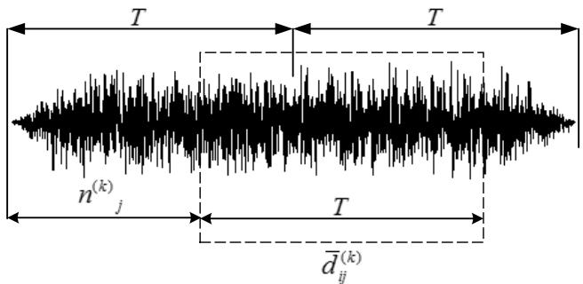  
图4.3 新一帧伪随机信号随机抽取过程示意图

将每次随机抽取后的新一帧伪随机输入信号通过加窗叠加的方式形成任意长度的真随机输入信号，以三帧信号叠加过程为例，过程如图4.4所示，其中  $\bar{d}_{ij}^{(k)}$  为第  $k$  次随机抽取的新伪随机输入信号，对每次抽取的信号加窗后依次进行延时  $T / 2$  叠加，最后形成长度为  $2T$  的真随机输入信号  $\tilde{d}_{ij}^{(k)}$  。

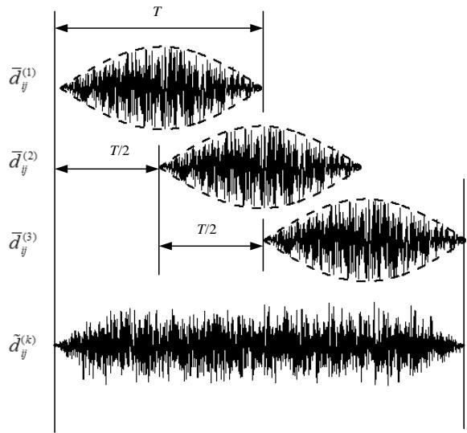  
图4.4 真随机输入信号加窗叠加生成过程示意图

根据MIMO随机振动控制理论，通过时域随机化法计算得到的真随机输入信号  $\tilde{d}$  为  $N$  维矩阵，其每一行信号对应一个输入通道（即每一行对应同一台振动台），因此只要对真随机输入信号矩阵  $\tilde{d}$  的每一行进行求和，便可得到真随机输入信号的向量形式  $X = [x_{1}, x_{2}, \dots, x_{N}]^{T}$ 。

# 4.3 矩阵幂次控制算法

本文建立的多输入多输出振动控制系统所采用的控制修正算法是由崔旭利提出的矩阵幂次控制算法，该算法采用通过修正驱动频谱  $D$  中的下三角矩阵  $L$  来进行响应功率谱的控制，只需保证下三角矩阵  $L$  的对角元素一直大于零，便能避免因直接修正驱动谱  $S_{dd}$  而容易产生的正定问题。矩阵幂次算法采用矩阵乘法修正的方式，不仅能够对响应谱  $S_{yy}$  的对角元素（即响应点的自功率谱密度）进行稳定收敛控制，而且对非对角元（即响应点互功率谱密度）也具有一定修正能力。

在频域内，驱动频谱  $D$  即为输入信号频谱  $X$  ，根据式（4.8）可知：

$$
Y = G L \tag {4.16}
$$

式中， $Y$  为响应频谱矩阵即控制目标矩阵，将式（4.14）代入上式得：

$$
Y = G A L P \tag {4.17}
$$

通过式（4.5）、（4.17）可计算响应功率谱矩阵为：

$$
S _ {y y} = Y Y ^ {H} = G A L P P ^ {H} L ^ {H} A ^ {H} G ^ {H} = L L ^ {H} = R \tag {4.18}
$$

$S_{yy}$  的对角元素为响应点的自功率谱矩阵，根据其物理含义可知  $S_{yy}$  正定，可进行Cholesky分解：

$$
S _ {y y} = L _ {s} L _ {s} ^ {H} \tag {4.19}
$$

因为在频响函数估计中存在误差以及其他系统因素的影响，式子（4.18）中的系统补偿矩阵  $A$  并不是实际系统补偿矩阵，存在一定的测量误差，假定测量系统补偿矩阵为  $\tilde{A}$ ，实际系统补偿矩阵为  $A$ ，则存在误差修正矩阵  $\tilde{E}$  使得：

$$
\tilde {A} = A \tilde {E} \tag {4.20}
$$

并根据式（4.18）可得：

$$
S _ {y y} = G A \tilde {E} L P P ^ {H} L ^ {H} \tilde {E} ^ {H} A ^ {H} G ^ {H} = \tilde {E} L L ^ {H} \tilde {E} ^ {H} = \tilde {E} R \tilde {E} ^ {H} \tag {4.21}
$$

根据上式可知存在一个修正矩阵  $\Delta$  使得：

$$
\Delta S _ {y y} \Delta = R \tag {4.22}
$$

联立式（4.5）、（4.19）和（4.22）可得：

$$
\Delta L _ {s} L _ {s} ^ {H} \Delta^ {H} = L L ^ {H} \tag {4.23}
$$

因为进行Cholesky分解具有唯一性，根据上式两端能够推断出：

$$
\Delta = L L _ {s} ^ {- 1} \tag {4.24}
$$

因此，可由计算得到的修正矩阵  $\Delta$  对  $L$  进行修正，在此可定义收敛幂指数  $\varepsilon$  对收敛速度和控制精度进行设定，幂指数越小收敛速度慢但控制精度高，反之亦然，一般取值范围在区间  $(0,1]$  内。

具体修正公式如下：

$$
L _ {\text {n e w}} = \Delta^ {\varepsilon} L _ {\text {o l d}} \tag {4.25}
$$

通过以上的公式推导，式（4.19）、（4.24）、（4.25）即为矩阵幂次控制算法的主要构成部分。

具体闭环修正流程框图如图4.5所示。

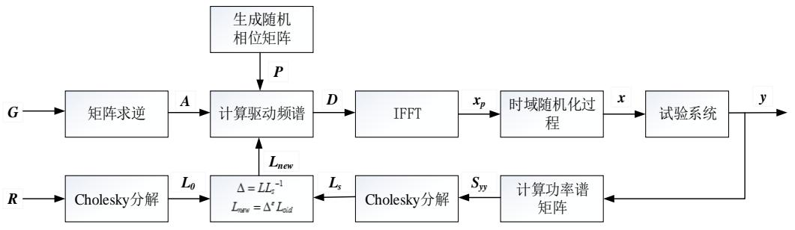  
图4.5 矩阵幂次算法控制流程框图

# 4.4 MIMO随机振动控制系统仿真验证

根据以上分析的随机输入信号生成方法和矩阵幂次算法，在Matlab/Simulink中建立多输入多输出随机振动控制系统模型，并引入Stateflow模块以实现多种状态切换控制。

# 4.4.1 频响函数估计

本章采用的仿真模型是尺寸为  $1 \times 0.1 \times 0.01(\mathrm{m})$  的悬臂梁，其有限元模型如图4.6所示，将悬臂梁分为5个单元，6个节点，12个自由度，其中设自由度1和3为激励位置和响应控制点，并采用状态空间模块进行悬臂梁有限元模型的输入输出系统的建立。

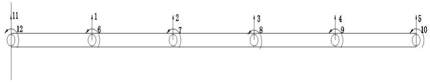  
图4.6悬臂梁节点划分有限元模型

  
图4.7悬臂梁频响函数估计Simulink模型图

图4.7为悬臂梁以1和3自由度为激励和响应点的加速度频响函数估计Simulink模型图，采用  $\mathrm{H}_{1}$  估计模型进行频响函数计算，测量频带范围为  $0 - 2000\mathrm{Hz}$ ，计算的频响函数幅频图如图

# 4.8所示。

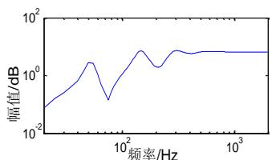

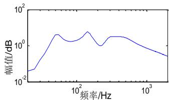

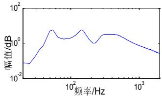  
图4.8悬臂梁模型频响函数幅频图

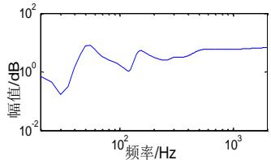

# 4.4.2 MIMO控制系统仿真验证

引入Stateflow模块，在Simulink中建立多输入多输出振动控制系统，系统模型如图4.9所示。图中Chart即为Stateflow模块主要构成部分，可根据外部输入参数的改变进行状态切换并实现信号数据的持续输出。

Display 模块中显示的数字可代表当前系统处于的修正状态，修正状态分为停止修正、正常量级修正和低量级修正三种，状态可通过点击手动开关模块进行选择。例如将手动开关模块（Manual Switch）连接到 0 信号输入模块，则此时控制系统将处于正常量级控制修正状态。仿真时间设定为 100 秒，仿真过程可自行切换修正状态。

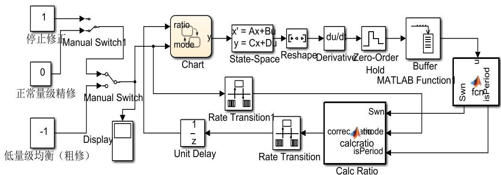  
图4.9 多输入多输出梁模型振动控制系统模型图

控制频段设为  $20 - 2000\mathrm{Hz}$ ，控制点参考谱自谱设置中设置在  $20 - 100\mathrm{Hz}$  频段为  $+3\mathrm{dB}$  的上升谱， $100 - 1000\mathrm{Hz}$  频段为幅值为  $0.1\mathrm{g}$  的平直谱， $1000 - 2000\mathrm{Hz}$  频段为  $-3\mathrm{dB}$  的下降谱；互谱密度中设置相干系数为在  $20 - 2000\mathrm{Hz}$  频段数值从  $0.1$  线性增加到  $0.8$ ，相位设置为两点相差  $90$  度。

控制点的功率谱估计采用周期迭代平均，每次控制修正后功率谱进行60次周期平均计算，

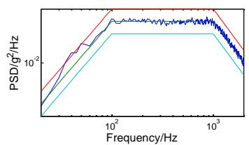  
图4.10为控制修正前的功率谱密度结果。

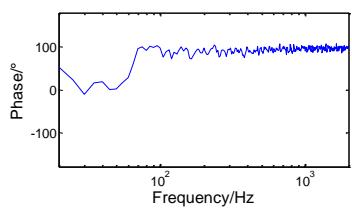

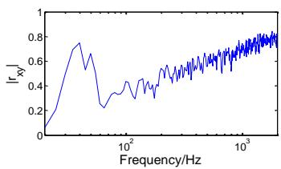  
图4.10多输入多输出振动控制修正前结果

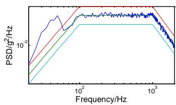

从图4.10中可以看出在  $20 - 70\mathrm{Hz}$  频段内控制点3的自谱密度明显高于参考谱曲线（图中右下角曲线），且相位和互谱的结果并不理想，产生误差的原因是由于频响估计误差以及随机输入信号生成误差造成的，因此需要进一步进行控制修正。

通过建立的多输入多输出振动控制系统进行修正，得到如图4.11的结果。

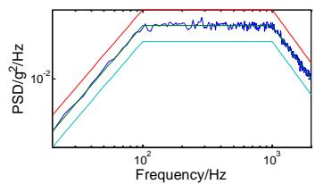

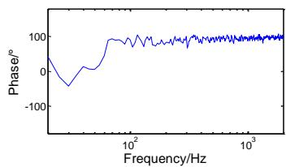

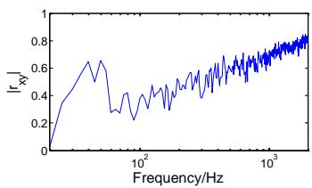  
图4.11多输入多输出振动控制修正结果

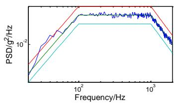

从图中可以看出在  $20 - 70\mathrm{Hz}$  频段内控制点3的加速度功率谱曲线明显下降，两个控制点功率谱密度曲线未超出3dB的参考谱容许差限，修正后控制点加速度功率谱曲线与参考谱曲线能够达到基本吻合，说明该修正算法具有良好的控制修正效果。

从仿真结果来看，本章建立的MIMO随机振动控制系统具有良好的自谱和互谱控制修正效果，能够实现多输入多输出振系统的随机振动控制。

# 4.5 本章小结

本章介绍了MIMO振动系统的频响函数估计方法，在不考虑输入噪声的情况下课采用  $H_{1}$

估计模型进行多输入多输出系统频响函数的计算；分析了采用时域随机化的随机输入信号生成方法，实现频域信号向时域信号的转换；推导了具有自谱和互谱控制能力的矩阵幂次算法修正原理，介绍了采用矩阵幂次法进行闭环振动控制的流程步骤。

本章还采用时域随机化的随机输入信号生成方法和矩阵幂次修正算法建立了MIMO随机振动控制系统，并进行了梁有限元模型多输入多输出随机振动控制仿真试验，随机控制修正结果验证了建立的MIMO随机振动控制系统的可行性和有效性。

# 第五章 虚拟MIMO随机振动试验及验证

本文虚拟振动环境试验系统的创建主要包含电动振动台机械模型和电磁作动系统的建立、导弹试验件有限元模型的建立和修正、矩阵幂次算法振动控制仪的建立三个主要部分。第四章中已验证了矩阵幂次算法振动控制仪的可行性和有效性。为了提高仿真试验的准确性和真实性，电动振动台机械模型集中参数和电磁作动系统电参数需要通过实际试验测得的电动振动台频响曲线进行识别，导弹试验件有限元模型建立后需要通过实际导弹试验件模态试验结果进行修正。

实现电动振动台机械电磁系统和导弹有限元模型的修正后，进行电动振动台机械电磁系统、导弹有限元模型以及矩阵幂次算法振动控制系统的联合仿真，通过振动控制系统使控制点的加速度功率谱密度处于设定的参考谱容差限内，此时观察导弹有限元模型监测点的加速度功率谱响应情况，并通过实际试验验证联合仿真结果的真实性和可靠性。

# 5.1 电动振动台机械电磁系统的建立

本章将型号为ES-80LS3-445电动振动试验系统作为仿真对象，其主要工作性能如表5.1所示。

表 5.1 型号 ES-80LS3-445 电动振动试验系统工作性能  

<table><tr><td>频率范围</td><td>正弦激振力</td><td>随机激振力</td><td>最大负载</td><td>最大加速度</td><td>最大位移</td><td>最大速度</td></tr><tr><td>2-2500Hz</td><td>80kN</td><td>80kN</td><td>2000kg</td><td>1000m/s²</td><td>76mm</td><td>2m/s</td></tr></table>

由于电动振动台机械结构复杂，建立电动振动台机械模型之前需要对电动振动台的机械构造进行简化处理，一般采用集中质量参数的方法，将其运动部件当作具有一定质量的刚性体处理。较为准确的电动振动台机械运动简化模型是三自由度运动模型，将台面、驱动线圈以及支撑悬挂装置视为为三个集中质量刚性体，各个集中质量体之间可视为通过弹簧以及阻尼器相连接。其中支撑悬挂装置通过空气气垫由基座(地面)支撑，台面通过弹簧悬挂在支撑悬挂装置上，而驱动线圈粘附在台体的动圈骨架上（粘附连接处可视为刚度极大的弹簧）。驱动线圈处于垂直于线圈的磁场中，当电动振动台进行工作时，驱动线圈内有电流通过，驱动线圈会受到电磁力的作用，并且电磁力反作用于悬挂装置上。可根据安培定理对电磁力的大小进行计算：

$$
F = B \ln i = K _ {f} i \tag {5.1}
$$

其中， $B$  为磁场强度(T)， $l$  为单匝线圈长度(m)， $n$  为线圈总匝数， $i$  为线圈内的电流(A)，当线圈运动幅度较小时，可将式（5.1）中  $F$  与  $i$  的关系视为线性变化，将其比例关系记为  $K_{f}$  ，

也称之为力常数。另一方面，当线圈在磁场内运动时因切割磁场线会在线圈两端产生感应电动势，其大小与线圈运动速度有关，可表示为：

$$
E = B l i \dot {x} = K _ {f} \dot {x} \tag {5.2}
$$

式中， $\dot{x}$  为线圈相对于磁场的速度  $(\mathrm{m} / \mathrm{s})$  ，同样当运动幅度不大时上式也视为线性变化关系，且其比例系数大小与力常数大小一致。

考虑到电动振动台驱动线圈的阻抗特性，其输入电压与线路电流的关系可表示为：

$$
R i + L \frac {d i}{d t} + K _ {f} \dot {x} = e \tag {5.3}
$$

式中，  $R$  为驱动线圈电阻  $(\Omega)$  ，  $L$  为驱动线圈自感系数(H)，  $e$  为加载在线圈两端的电压(V)。

通过以上分析，电动振动台三自由度简化运动模型的机电运动系统可由下列方程表示：

$$
\left\{ \begin{array}{c} m _ {c} \ddot {x} _ {c} + c _ {c} \dot {x} _ {c} - c _ {c} \dot {x} _ {t} + k _ {c} x _ {c} - k _ {c} x _ {t} = K _ {f} i \\ m _ {t} \ddot {x} _ {t} - c _ {c} \dot {x} _ {c} + \left(c _ {c} + c _ {a}\right) \dot {x} _ {t} - c _ {a} \dot {x} _ {b} - k _ {c} x _ {c} + \left(k _ {c} + k _ {a}\right) x _ {t} - k _ {a} x _ {b} = 0 \\ m _ {b} \ddot {x} _ {b} - c _ {a} \dot {x} _ {t} + \left(c _ {a} + c _ {b}\right) \dot {x} _ {b} - k _ {a} x _ {t} + \left(k _ {a} + k _ {b}\right) x _ {b} = - K _ {f} i \\ e = i R + L \frac {d i}{d t} + K _ {f} \left(\dot {x} _ {c} - \dot {x} _ {b}\right) \end{array} \right. \tag {5.4}
$$

式中,  $m_{c} 、 m_{t} 、 m_{b}$  分别为驱动线圈、台面、悬挂装置的质量,  $x_{c} 、 x_{t} 、 x_{b}$  分别为驱动线圈、台面、悬挂装置的位移,  $k_{c}$  为台面与驱动线圈之间的刚度,  $k_{a}$  为动圈组合体与悬挂装置之间的刚度,  $k_{b}$  为空气气垫的刚度,  $c_{c}$  为台面与驱动线圈之间的阻尼,  $c_{a}$  为动圈组合体与悬挂装置之间的阻尼,  $c_{b}$  为空气气垫的阻尼。

根据式（5.4）在Virtual.lab中建立电动振动台机械模型，模型简化结构如图5.1所示。

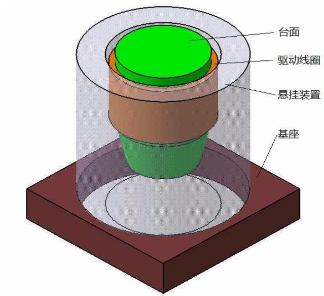  
图5.1 电动振动台机械结构集中质量模型

在机械模型中各个运动部件间采用弹簧阻尼器连接，并且分别创建两个 force 输入节点，

一个作用在驱动线圈上，另一个作用在悬挂装置底部，然后将驱动线圈速度与台面加速度作为输出节点，运行计算 solution.set 后得到一个可在 Matlab/Simulink 中运行的名为 plantout 的 m 文件。得到该 plantout.m 文件后可在 Simulink 中建立电动振动台电磁作动系统，具体模型如图 5.2 所示。

  
图5.2单电动振动台机电系统Simulink模型

在图5.2的Simulink模型中Band-Limited模块的输入端口即为电动振动台驱动电压信号输入端口，plantout模块输出端口即为电动振动台物理量（速度、加速度、位移等）输出端口。可采用图5.2模型进行电动振动台定压和定流的加速度频响特性分析。

电动振动台机电模型的建立需要确定各个运动自由度质量以及连接弹簧刚度和阻尼、线圈电阻和自感系数、力常数等参数具体数据，可根据第二章分析的电动振动台定流和定压下的加速度频响特性结论以及实际试验测得的加速度频响特性对这些参数进行计算修正。

经试验以及分析可以确定试验电动振动台的机电参数具体值如表5.2所示。

表 5.2 电动振动台机电模型各参数具体值  

<table><tr><td>变量</td><td>数值</td><td>变量</td><td>数值</td><td>变量</td><td>数值</td></tr><tr><td>mc(kg)</td><td>14.6</td><td>mt(kg)</td><td>40.8</td><td>mb(kg)</td><td>346</td></tr><tr><td>kc(N/m)</td><td>2.045×10^9</td><td>ka(N/m)</td><td>4.0167×10^4</td><td>kb(N/m)</td><td>7.21×10^2</td></tr><tr><td>cc(kg/s)</td><td>6604.8</td><td>ca(kg/s)</td><td>870.1</td><td>cb(kg/s)</td><td>24900</td></tr><tr><td>R(Ω)</td><td>0.061913</td><td>L(mH)</td><td>0.0273</td><td>Kf(N/A)</td><td>65.9</td></tr></table>

根据表5.2中的模型参数对建立的电动振动台机电模型进行设置，并采用图5.2的Simulink模型进行定压和定流下电动振动台加速度频响函数估计，图5.3、5.4分别定电压和定电流下实际试验测得的频响曲线与建立的电动振动台机电模型频响曲线对比图。

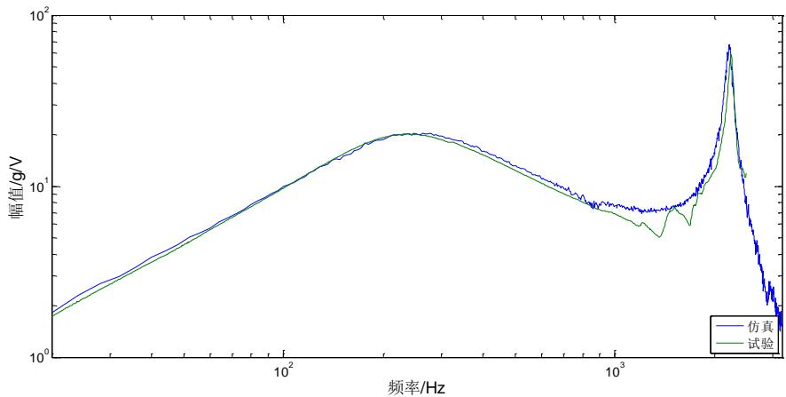  
图5.3定电压下电动振动台试验频响与仿真频响对比图

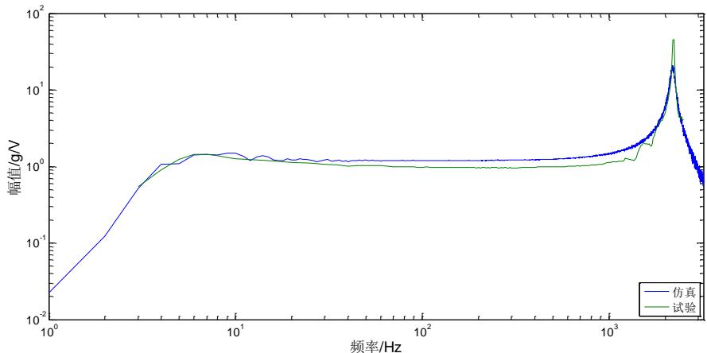  
图5.4定电流下电动振动台试验频响与仿真频响对比图

从图5.3和5.4中可以明显看出仿真计算的加速度频响曲线和试验测得的频响曲线吻合良好，说明仿真建立的电动振动台机电模型系统具有较高的准确度，一定程度上能提高虚拟振动环境试验的真实性和可靠性。

# 5.2 虚拟振动环境试验系统建立

首先采用导弹试验件模态试验对导弹有限元模型进行修正，提高仿真建模精度，然后将修正后的导弹有限元模型和双电动振动台进行刚柔耦合分析，建立刚柔耦合模型，最后将双电动振动台导弹刚柔耦合模型与Simulink进行电磁作动系统、振动控制系统的联合仿真系统的建立。

# 5.2.1 试验件有限元模型建立与修正

本文以导弹试验件作为试验仿真对象，导弹试验件的长度为  $3500\mathrm{mm}$ ，直径为  $300\mathrm{mm}$ ，导弹壳厚为  $10\mathrm{mm}$ ，导弹尾翼厚度为  $8\mathrm{mm}$ 。

首先对实际导弹试验件进行模态参数识别，得到导弹的各阶振型、频率信息，然后在有限

元建模软件中建立导弹有限元模型，并根据试验的导弹模态参数对导弹有限元模型进行材料属性等参数修正，以提高导弹有限元建模精度和振动试验仿真的可靠性。

采用力锤法和LMS数据采集分析仪进行导弹模型的模态参数识别，为了避免刚性地面对测试结构的影响，将导弹模型放在柔性较大的海绵材料上，锤击点以  $100\mathrm{mm}$  为间隔沿轴向方向均匀分布在导弹模型壳体上，响应信号采集点置于弹头位置，测试试验现场图如图5.5所示。

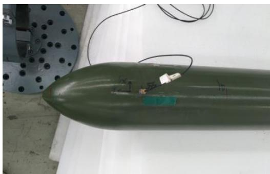  
（a）响应采集位置

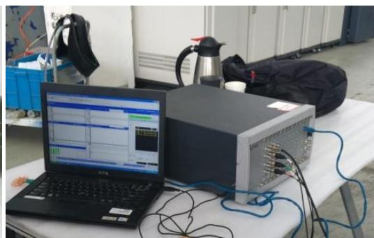  
（b）LMS数据采集分析仪

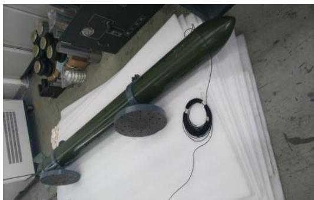  
（c）导弹模型实体图

  
(d) 力锤

  
图5.5导弹模型模态分析试验现场  
（1）第一阶模态

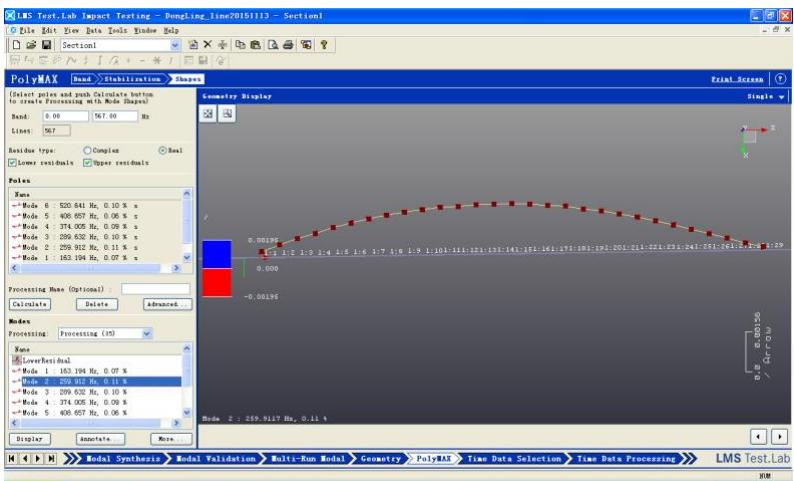  
（2）第二阶模态

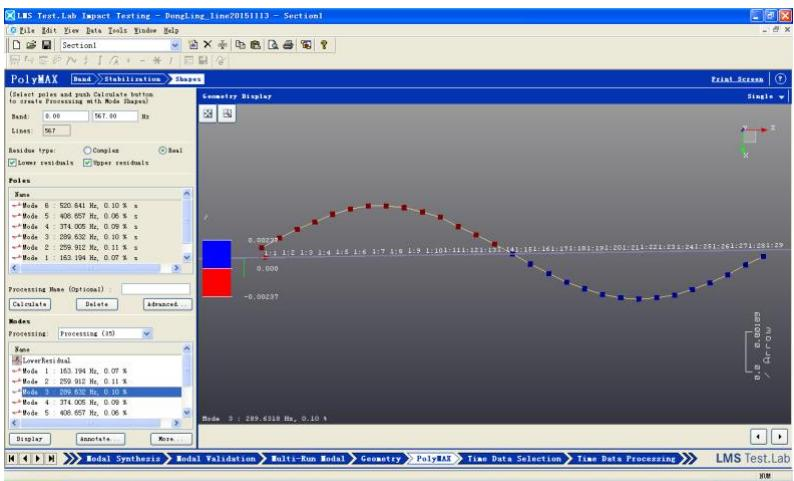  
(3) 第三阶模态

  
（4）第四阶模态

  
（5）第五阶模态  
图5.6导弹模型前五阶模态

依次敲击导弹壳体预设的激励点并采用LMS test.lab软件计算各激励点的频响函数，通过各激励点的频响进行导弹模型的模态参数识别，图5.6为导弹模型壳体一条轴向线上的前四阶模态振型和固有频率。

根据以上模态测试的数据在 patran 中建立导弹有限元模型，材料属性设置中弹性模量设定为  $2.1 \times 10^{5} \mathrm{Mpa}$ ，泊松比为 0.266，材料密度为  $7.85 \times 10^{-9}$  吨/毫米³，设置结束后进行有限元模型的模态分析计算，得到与测试模态相对应的振型和固有频率如图 5.7 和表 5.3 所示。

表 5.3 导弹有限元模型前五阶固有频率  

<table><tr><td>阶次</td><td>1</td><td>2</td><td>3</td><td>4</td><td>5</td></tr><tr><td>试验固有频率（Hz）</td><td>163.194</td><td>259.912</td><td>289.632</td><td>374.005</td><td>408.657</td></tr><tr><td>仿真固有频率（Hz）</td><td>168.5</td><td>255.54</td><td>282.8</td><td>366.15</td><td>426.8</td></tr><tr><td>与测试误差（%）</td><td>3.2</td><td>1.7</td><td>2.4</td><td>2.1</td><td>4.4</td></tr></table>

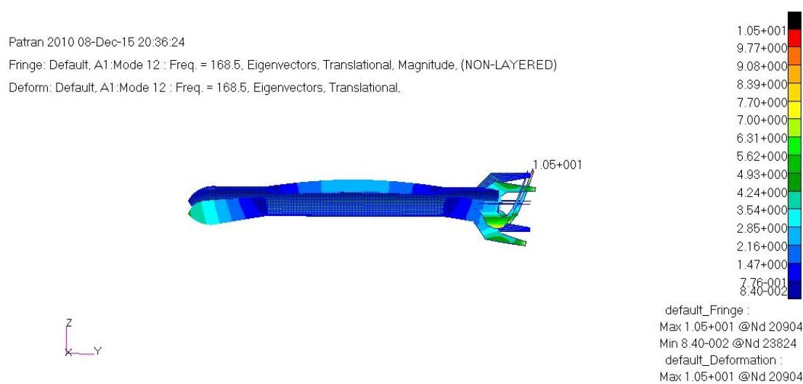  
（1）第一阶模态振型

Patran 2010 08-Dec-15 20:39:35

Fringe: Default, A1:Mode 18: Freq. = 255.54. Eigenvectors, Translational, Magnitude, (NON-LAYERED)

Deform: Default, A1:Mode 18: Freq. = 255.54, Eigenvectors, Translational,

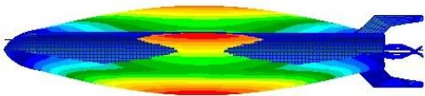

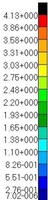

default_Fringe

Max 4.13+000 @Nd 21891

Min 7.02-006 @Nd 21220

default_Deformation

Max 4.13+000 @ Nd 21891

# （2）第二阶模态振型

Patran 2010 08-Dec-15 20:40:17

Fringe: Default, A1:Mode 20 : Freq. = 282.8, Eigenvectors, Translational, Magnitude, (NON-LAYERED)

Deform: Default, A1: Mode 20: Freq. = 282.8, Eigenvectors, Translational,

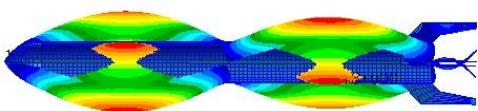

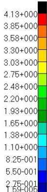

default_Fringe

Max 4.13+000 @Nd 24589

Min 1.59-005 @Nd 21220

default_Deformation

Max 4.13+000 @Nd 24589

# （3）第三阶模态振型

Patran 2010 08-Dec-15 20:40:44

Fringe: Default, A1:Mode 22: Freq. = 366.15, Eigenvectors, Translational, Magnitude, (NON-LAYERED)

Deform: Default, A1:Mode 22 : Freq. = 366.15, Eigenvectors, Translational,

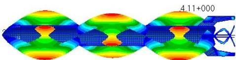

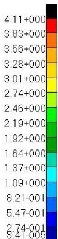

default_Fringe

Max 4.11+000 @Nd 24598

Min 3.41-005 @Nd 21220

default_Dformation

Max 4.11+000 @Nd 24598

Patran 2010 08-Dec-15 20:40:56

Fringe: Default, A1: Mode 27; Freq. = 426.8, Eigenvectors, Translational, Magnitude. (NON-LAYERED)

Deform: Default, A1: Mode 27: Freq. = 426.8, Eigenvectors, Translational,

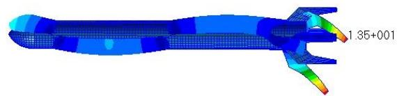  
图5.7导弹有限元模型模态振型

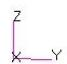

default_Fringe

Max 1.35+001 @Nd 20942

Min 3.32-002 @Nd 23994

default_Deformation

Max 1.35+001 @Nd 20942

# （5）第五阶模态振型

从表5.3和图5.7可以看出仿真建立的导弹有限元模型各阶固有频率和试验测得的数据吻合良好，表明在  $10 - 500\mathrm{Hz}$  频段以内导弹有限元模型能够体现出良好的仿真效果，具有一定的可靠性，可使用该导弹有限元模型进行下一步的联合仿真工作。

# 5.2.2 双电动振动台导弹刚柔耦合模型

根据5.1节建立电动振动台机械电磁系统过程和结果，建立双电动振动台机械模型，并加入夹具和导弹构件，采用夹具将导弹构件安装在两个电动振动台台面上，由于导弹构件属于集中质量构件，需要进行柔性化处理才能具备各阶模态信息，具体柔性化过程采用导入上节中导弹有限元模型BDF文件的方式，导入导弹有限元模型BDF分析文件即可将导弹几何特性、材料属性等信息一同导入到Vitrual.lab中。进行导弹模型柔性化后的双振动台导弹模型如图5.8所示。

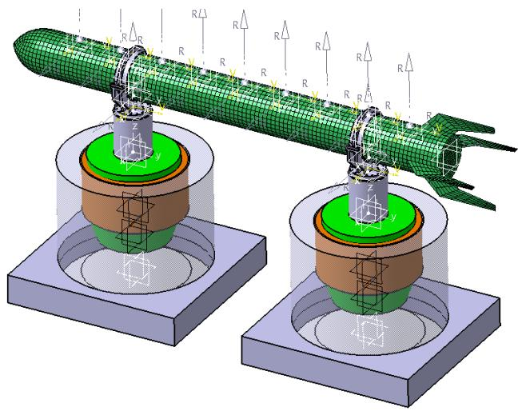  
图5.8双电动振动台导弹模型图

由于导弹柔性体与夹具连接面受到夹具的约束，因此在进行导弹柔性体与振动台刚性体刚柔耦合模态分析时，需要对该连接面进行约束，通常采用rigid-spider选项将连接面上的有限元节点进行选取，便可将连接面处的节点进行固定约束。对夹具与导弹柔性体连接面进行约束后，采用Craig-Bampton模态综合法在导弹柔性体分析文件中进行刚柔耦合模态分析，模态分析选择前50阶模态即可。

在导弹柔性体文件中添加一个Mode.set，在该Mode.set中选择导弹柔性体刚柔耦合模态分析结果，剔除20阶以上的模态（剔除不必要的模态可提高仿真速度），并设置各阶阻尼比。前20阶模态固有频率如表5.4所示。

表 5.4 电动振动台导弹模型刚柔耦合模态前 20 阶固有频率  

<table><tr><td>模态阶数</td><td>固有频率(Hz)</td><td>模态阶数</td><td>固有频率(Hz)</td></tr><tr><td>1</td><td>53.9</td><td>11</td><td>361.8</td></tr><tr><td>2</td><td>54.7</td><td>12</td><td>439.3</td></tr><tr><td>3</td><td>55.3</td><td>13</td><td>521.8</td></tr><tr><td>4</td><td>169.8</td><td>14</td><td>574.7</td></tr><tr><td>5</td><td>196.7</td><td>15</td><td>580.2</td></tr><tr><td>6</td><td>198.5</td><td>16</td><td>604.1</td></tr><tr><td>7</td><td>203.9</td><td>17</td><td>625.6</td></tr><tr><td>8</td><td>327.7</td><td>18</td><td>639.4</td></tr><tr><td>9</td><td>359.0</td><td>19</td><td>712.7</td></tr><tr><td>10</td><td>361.4</td><td>20</td><td>722.4</td></tr></table>

导弹柔性体的刚柔耦合模态包含多数尾翼模态，图5.9主要展示导弹柔性体弹身部分的刚柔耦合模态振型。

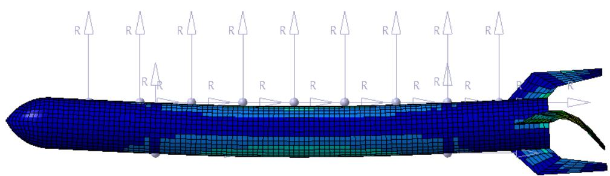  
（1）固频为  $169.8\mathrm{Hz}$  的模态振型

  
（2）固频为  $327.7\mathrm{Hz}$  的模态振型

  
(3) 固频为  $439.2 \mathrm{~Hz}$  的模态振型  
（4）固频为  $521.8\mathrm{Hz}$  的模态振型

  
（5）固频为  $574.7\mathrm{Hz}$  的模态振型

  
(6) 固频为  $712.7 \mathrm{~Hz}$  的模态振型

回到双电动振动台导弹模型文件，选择 Solution.set 为 Mode.set，便将导弹柔性体的刚柔耦合模态信息导入到双电动振动台导弹模型系统中。此时在 Solution.set 中将 Method Integration 选项设为 MATLAB_COSIM，计算 Solution.set，便能在分析文件所在目录中产生一个 plantout.m 的脚本文件，该脚本文件用于与 Matlab/Simulink 的联合仿真。

# 5.2.3 双电动振动台导弹模型 Simulink 仿真系统建立

双电动振动台导弹模型Simulink仿真系统包含频响函数测试系统和振动控制仿真系统两个部分，其建立的理论是根据第四章介绍的频响函数估计方法、随机信号生成方式和矩阵幂次控制算法。频响估计结果用于控制系统中初始驱动信号的生成。

  
图5.9导弹柔性体刚柔耦合模态振型  
图5.10导弹有限元模型输出点位置

根据5.1节的分析结果，在Simulink中建立双电动振动台电磁作动系统，两个电动振动台分别有两个force输入通道，分别作用在电动振动台的驱动线圈上和支撑悬挂装置上，并且将驱动线圈速度信号作为输出点。在导弹有限元模型上建立9个输出点（包含监测点和控制点），输出信号为加速度响应信号，输出点位置间隔为  $300\mathrm{mm}$ ，输出点位置如图5.10所示。

根据频响函数估计方法，建立如图5.11的双电动振动台导弹模型Simulink频响测试系统图。图中plantout模块为双电动振动台导弹有限元模型系统模块，拥有四个输入force通道和11个输出信号通道。Band-Limited模块用于产出白噪声信号，MATLAB Funtion用于频响函数计算。

  
图5.11 双电动振动台导弹模型Simulink频响测试系统图

根据第四章分析的MIMO随机振动控制系统建立方法，建立如图5.12所示的双电动振动台导弹模型随机振动控制Simulink仿真系统。图中jedian24和jedian6作为控制点，其余输出点作为监测点。

  
图5.12 双电动振动台导弹模型随机振动控制Simulink仿真系统图

# 5.3 联合仿真与试验验证

建立了双电动振动台导弹试验件刚柔耦合动力学模型、电磁作动系统以及振动控制系统的联合仿真系统模型后，进行多输入多输出虚拟随机振动控制实验，对控制点进行加速度响应功率谱控制，并观察监测点的加速度频谱响应情况以及计算加速度时域信号均方根值。最后通过实际导弹模型多输入多输出随机振动试验进行对比验证。

# 5.3.1 虚拟随机振动控制试验

设置控制频段为  $10 - 500\mathrm{Hz}$ ，控制点为图5.13所示的2号和8号点。2号控制点参考谱设置中设置在  $10 - 40\mathrm{Hz}$  频段为  $0.01\mathrm{g}$  的平直谱， $40 - 101\mathrm{Hz}$  频段为斜率-3dB的下降谱， $101 - 500\mathrm{Hz}$  频段为  $0.003\mathrm{g}$  的平直谱；8号控制点参考谱设置中设置在  $10 - 62\mathrm{Hz}$  为  $0.01\mathrm{g}$  的平直谱， $62 - 100\mathrm{Hz}$  频段为斜率3dB的上升谱， $100 - 500\mathrm{Hz}$  频段为  $0.016\mathrm{g}$  的平直谱。参考谱互谱设置中相干系数在 $0 - 500\mathrm{Hz}$  频段内均为0.8，相位设置为两点相差0度。

  
图5.13导弹模型控制点和监测点位置

首先进行双电动振动台导弹模型的控制点频响函数计算，采用图5.11展示的Simulink系统模型，输入信号为电压信号，输出信号为控制点2号和8号的加速度响应信号。系统测试频响函数曲线如图5.14所示。

  
图5.14双电动振动台导弹模型的频响函数曲线图

计算频响函数结束后，采用图5.12展示的双电动振动台导弹模型Simulink振动控制仿真模型进行2号和8号控制点的随机振动控制，图5.15为进行修正控制后的加速度功率谱响应结果，图5.16为在该控制结果下监测点的加速度响应情况。

  
图5.15双电动振动台导弹模型仿真试验控制点控制结果

  
图5.16仿真试验监测点加速度功率谱密度以及均方根值

图5.15中的对角位置图分别是控制点2号和8号的自谱控制结果，处于右上方的是两个控制点的相位差，处于左下方的是两个控制点的相干系数。从该控制结果可以明显看出2号和8号控制点自谱密度并未超出设定的容差限，2号控制点在  $110\mathrm{Hz}$  左右有明显尖峰凸起，但都在允许范围内，两个控制点间的相位差大小与设定的参考值偏差较小，相干系数除了在  $11\mathrm{Hz}$  处有明显下降外在其余频段都能保持与参考值有较小的误差。

图5.16中按从左到右、从上到下的顺序分别为监测点1、4、6、9的加速度自谱密度响应结果，并且列出了加速度时域信号的均方根值。可以看出在靠近导弹模型中间位置的4号和6号点加速度响应的均方根值较大，靠近两端的1号和9号加速度响应的均方根值较小。由于设

置的参考谱中，2号控制点谱值为下降谱，8号控制点谱值为上升谱，因此在2号控制点附近的监测点加速度均方根值比8号控制点附近的监测点相对偏小。

# 5.3.2 试验验证

导弹试验件多输入多输出随机振动控制试验采用两个型号为ES-80LS3-445电动振动台试验系统以及美国TI公司生产的Vibstar振动控制仪。导弹试验件的长度为  $3500\mathrm{mm}$ ，直径为 $300\mathrm{mm}$ ，导弹壳厚为  $10\mathrm{mm}$ ，导弹尾翼厚度为  $8\mathrm{mm}$  。通过球绞、夹具将导弹试验件安装在两个振动台台面上，并按照图5.10所示的输出点位置以  $300\mathrm{mm}$  为间隔在导弹试验件上安装加速度传感器，实际试验场景如图5.17所示。

  
图5.17 双电动振动台导弹模型振动控制试验现场

控制点与监测点通道按照图5.13所示的位置与控制仪系统进行连接，试验频段为  $10 - 500\mathrm{Hz}$  ，控制点为2号和8号点，参考谱设置与上节联合仿真试验中控制点参考谱设定相同。图5.18为控制点加速度自谱控制结果图，图5.19为监测点加速度响应结果图。

  
图5.18 双电动振动台导弹模型控制试验控制点2和8自谱控制结果

  
图5.19 控制试验监测点加速度功率谱密度以及均方根值

在图5.18中第一幅图为控制点2加速度自谱密度控制结果，第二幅图为控制点8控制结果。在低频段内两个控制点的振动控制结果良好，但在  $300 - 500\mathrm{Hz}$  频段内，控制点2和8的自谱控制结果并不是十分理想，与参考谱线的误差较大。在图5.19中，受高频段控制效果不佳的影响，监测点在高频段的响应情况比较复杂，加速度响应均方根值也明显较大，总体响应趋势与仿真结果相同，在控制点附近的监测点加速度响应均方根值相对较小，在导弹模型中间处的监测点加速度响应均方根值相对较大。

试验结果表明，在控制点参考谱设定相同的情况下，试验测得的各个监测点加速度响应均方根值大小分布趋势与控制试验仿真结果相同。

# 5.4 本章小结

本章首先通过试验测得电动振动台定流和定压下的频响曲线，根据该频响曲线对电动振动台各个物理参数、电参数进行识别确定，并采用这些参数建立了电动振动台机械电磁系统，电动振动台机电系统建立后进行频响特性测试，其测试结果与试验结果相吻合；

然后建立了导弹有限元模型，并通过导弹试验件模态试验对导弹有限元模型进行修正，使建立的导弹有限元模型达到一定仿真精度，并且采用修正后的导弹有限元模型与双电动振动台机械模型进行刚柔耦合建模和刚柔耦合模态分析；

接着采用双电动振动台导弹刚柔耦合模型与Simulink的进行联合仿真系统的建立，分别创建了双电动振动台导弹模型频响函数测试仿真系统和振动控制试验仿真系统，并进行了多输入多输出虚拟随机振动控制试验，仿真试验结果表明该振动控制仿真系统具有良好的随机振动控制效果，并且能观察的导弹模型各个监测点在试验过程中的加速度响应情况；

最后在两个型号为ES-80LS3-445电动振动台上进行了导弹试验件多输入多输出随机振动控制试验，并将控制结果和监测点加速度响应结果与联合仿真试验结果进行了对比。

# 第六章 总结与展望

# 6.1 本文主要工作和贡献

本文主要基于多种软件研究了MIMO随机振动控制试验的虚拟建模仿真技术，设计了一套虚拟振动环境试验系统的构建方案。最后通过导弹模型MIMO随机振动控制试验对该虚拟振动环境试验系统的可靠性和有效性进行了对比验证。本文的主要工作和贡献如下：

（1）通过试验测试得到电动振动台定压和定流下加速度频响特性曲线，建立了电动振动台机械电磁系统模型。电动振动台机械结构较为复杂，本文采用集中参数简化方法将其简化为三自由度运动模型，运动构件包含台面、驱动线圈和支撑悬挂装置，并且每个构件之间可视为通过弹簧阻尼器相连。除了集中质量、刚度阻尼参数需要进行确定外，试验还需要识别电动振动台电磁作动系统的线圈电阻、力常数和自感系数等电参数。结果表明，建立的电动振动台模型机械电磁系统频响曲线与试验数据吻合良好。  
（2）针对悬臂梁，基于Matlab/Simulink建立了MIMO随机振动控制系统，进行了仿真模拟。采用时域随机化随机输入信号生成方法和矩阵幂次修正算法建立了MIMO随机振动控制系统。基于Matlab/Simulink，采用状态空间法进行了梁有限元模型MIMO随机振动控制仿真试验，结果表明建立的MIMO随机振动控制系统具有一定的可行性和有效性。  
(3) 通过导弹试验件模态试验对导弹有限元模型进行了修正，建立了双电动振动台与导弹模型的刚柔耦合模型。电动振动台台面和夹具均作为刚体参与建模，因此导弹有限元模型中与夹具连接的节点需要进行刚性约束，并采用 Craig-Bampton 模态综合法对导弹有限元模型进行刚柔耦合模态分析。  
（4）联合建立的双电动振动台机电系统、导弹与振动台刚柔耦合模型和闭环振动控制系统完成了多输入多输出虚拟随机振动控制试验。仿真试验结果表明该虚拟振动控制试验系统具有良好的随机振动控制效果，虚拟试验中能观察导弹模型上任意选定监测点在试验过程中的加速度响应情况。  
（5）在两个型号为ES-80LS3-445电动振动台上进行了导弹模型多输入多输出随机振动控制试验，并将控制结果和监测点加速度响应结果与虚拟试验结果进行了对比。结果表明，本文所建立的虚拟试验系统能够反映导弹模型在试验中的真实响应特性。

# 6.2 后续研究与展望

本文进行的双电动振动台导弹模型虚拟随机振动控制试验虽然能反映试验件一些真实的响应特性，但对于实现实际工程应用价值、反应产品全面准确的响应特性仍有大量研究工作需要

进一步完成：

（1）本文振动控制虚拟试验研究频段只限于中低频段，对高频段多输入多输出虚拟振动环境试验将是下一步研究的重点；  
(2) 在进行电动振动台建模、试验件有限元建模时并不考虑模型的非线性特性，尤其在高频段系统模型的非线性特性表现将更为突出，采取何种有效的方法处理系统非线性特性将是亟需解决的研究问题；  
(3) 在处理导弹模型和夹具连接方式时作了简化处理，联合仿真试验结果并不能体现出导弹模型安装位置的真实响应情况，因此如何真实准确的模拟安装方式也是下一步的研究内容；  
（4）本文只研究了单轴多振动台虚拟振动环境试验的仿真设计方案，该方案对多轴多振动台振动试验是否也能适用也是一项待解决的问题。